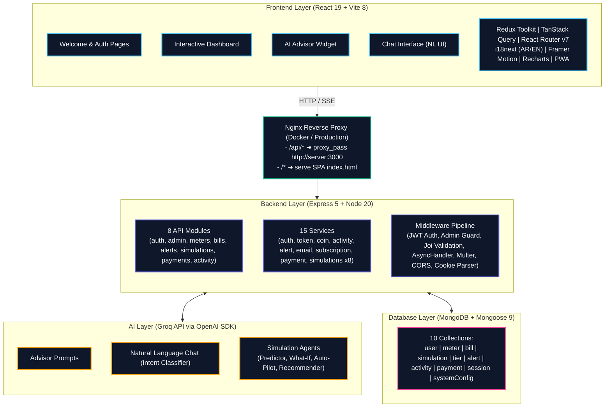

# Kashf ⚡- Smart Egyptian Electricity Consumption Assistant

An AI-powered electricity management platform that helps Egyptian households monitor electricity consumption, avoid costly Sheriha (billing tier) jumps, and receive personalized energy-saving recommendations through live smart meter integration. Features dedicated user and admin dashboards for consumption tracking, analytics, and management


Following the 2026 Egyptian electricity tariff increases, moving from one billing tier to another can significantly impact a household's electricity bill. Most consumers only discover they have crossed into a more expensive tier after receiving their monthly invoice. Kashf solves this problem by providing real-time consumption tracking, bill analysis, and proactive warnings before users exceed their current tier limits.

The application allows users to connect Kashf Smart Nodes to their electricity meters. Advanced embedded systems and AI technologies extract consumption data, calculate the user's current billing tier, estimate costs, and provide localized energy-saving recommendations in Egyptian Arabic.

---

🌐 **Live Demo:** [https://kashf-smart-electricity-assistant.netlify.app](https://kashf-smart-electricity-assistant.netlify.app/)

---

## 📸 Website Preview (UI Mockup)

<a href="https://kashf-smart-electricity-assistant.netlify.app" target="_blank" rel="noopener noreferrer" title="demo">
  
</a>

---

## 🚀 Key Features

### 🔌 Real-Time Smart Node Integration

* Connect embedded Smart Nodes directly to meters.
* Continuous real-time data streaming.
* Automatic sync of meter readings and consumption data.
* Fast and accurate processing powered by AI.

### ⚡ Sheriha (Tier) Tracking

* Detect current electricity billing tier.
* Calculate electricity consumption based on official Egyptian tariff rules.
* Estimate monthly electricity costs.
* Track remaining kilowatt-hours before reaching the next tier.

### 🔔 Proactive Tier Warnings

* Real-time notifications when approaching the next billing tier.
* Visual indicators showing consumption progress.
* Prevent unexpected increases in electricity bills.

### 📊 Interactive User Dashboard

* Mobile-first responsive design.
* Consumption analytics and historical records.
* Progress ring visualization showing current tier status.
* Color-coded alerts for critical consumption levels.

### 🤖 AI-Powered Energy Assistant

* Generates practical electricity-saving tips.
* Recommendations tailored to current consumption patterns.
* Responses delivered in Egyptian Arabic (Ammiya).
* Provides actionable advice rather than generic suggestions.

### 👨‍💼 Admin Dashboard

* User management.
* Consumption monitoring.
* Analytics and reporting.
* Tariff configuration management.
* System activity tracking.

### 📱 Progressive Web App (PWA)

* Installable on Android, iOS, Windows, and macOS devices.
* Mobile app-like experience with offline support.
* Fast loading with asset caching via service worker.
* No app store installation required.

---

## 🏗 Problem Statement

Egypt's electricity billing system uses a tiered pricing model known as "Sheriha." Under this system, increasing consumption can move users into higher pricing tiers, resulting in significantly higher monthly bills.

Many households are unaware of their current consumption status and receive no warning before crossing into a more expensive tier. Kashf addresses this challenge by acting as a smart electricity companion that continuously monitors usage and provides timely alerts before users exceed their current tier limits.

---

## 🎯 Project Objectives

* Simplify electricity bill understanding for Egyptian consumers.
* Prevent unexpected billing increases caused by tier jumps.
* Promote energy-efficient behavior through AI-powered recommendations.
* Provide a user-friendly mobile experience accessible to all households.
* Digitize electricity consumption tracking and analysis.

---

## 🖥️ System Architecture



### Frontend

* React 19 + React Compiler
* Vite 8 + Rolldown (Rust-based bundler)
* Tailwind CSS v4 — utility-first styling
* Redux Toolkit + TanStack React Query (state management)
* React Helmet Async (dynamic document head)
* i18next (Arabic & English) with full RTL support
* React Router v7 with lazy loading
* Framer Motion — scroll and spring animations
* Recharts — interactive data visualization
* Lucide React — icon system
* Mobile-first responsive design (PWA installable)

### Backend

* Node.js 20 + Express 5
* RESTful API with 8 feature modules
* JWT authentication with access/refresh token cookies
* Role-based authorization (user / admin)
* Stripe payment integration (subscriptions)
* Groq AI integration (consumption advisor, NL chat)
* Server-Sent Events (SSE) for real-time simulation streaming
* Multer + Cloudinary for image uploads
* Joi request validation
* 2FA (TOTP) support

### Database

* MongoDB with Mongoose 9 ODM
* 10 collections with indexes and TTL
* Consumption history, user data, billing tiers
* [Database Schema Diagrams](./docs/DATABASE_SCHEMA.md) — Full ERD and collection details

### AI Layer

* Groq API (OpenAI-compatible SDK)
* AI Consumption Advisor (Egyptian Arabic tips)
* Natural Language Chat Agent (intent classification)
* Tier Prediction Agent
* What-If Scenario Simulator
* Auto-Pilot Consumption Manager
* Smart Recommendations Engine

### Containerization (Docker)

* Docker Compose orchestrates client + server containers
* Multi-stage client build → Nginx for static serving + API proxy
* Server runs Node 20 Alpine (production-only dependencies)
* Hot-reload development available without Docker

---

## 📚 Documentation

| Document | Description |
|----------|-------------|
| [Database Schema Diagrams](./docs/DATABASE_SCHEMA.md) | ERD, collection details, indexes |
| [Sitemap & Information Architecture](./docs/01-sitemap-and-information-architecture.md) | Full route map, page structure, navigation flow |
| [Backend Services & Middlewares](./docs/02-backend-services-and-middlewares.md) | API architecture, middleware pipeline, service layer |
| [Project Guidelines](./docs/03-project-guidelines.md) | Setup, coding standards, conventions |
| [Simulation API](./docs/04-simulation-api.md) | Simulation engine endpoints and usage |
| [AI Agents](./docs/05-ai-agents.md) | AI features, prompts, agent architecture |
| [System Operations & User Flows](./docs/SYSTEM_OPERATIONS_AND_USER_FLOWS.md) | End-to-end user flows, error paths |
| [Team Tasks](./docs/teamTasks.md) | Task ownership and progress across workstreams |
| [Vercel Deployment](./docs/VERCEL_DEPLOYMENT.md) | Vercel deployment guide (primary) |
| [Netlify Deployment](./docs/NETLIFY_DEPLOYMENT.md) | Netlify deployment guide (fallback) |
| [Docker Setup](./docker-compose.yml) | Docker Compose — run full stack locally |

---

## 👤 User Workflow

1. Open Kashf on a mobile device.
2. Connect the Kashf Smart Node to the electricity meter.
3. The embedded system streams live consumption data.
4. The backend calculates:

   * Current Sheriha
   * Estimated monthly cost
   * Remaining kilowatt-hours before the next tier
5. Results are displayed on a visual dashboard.
6. The AI assistant generates three practical energy-saving tips in Egyptian Arabic.
7. Users receive alerts before reaching a higher billing tier.

---

## 📈 Dashboard Features

### User Dashboard

* Current consumption overview (Gauge visualizer)
* Billing tier status
* Remaining kilowatt-hours
* Estimated monthly cost
* Historical consumption trends (Line charts)
* AI recommendations & advice
* My Meters CRUD (Managed via Redux Toolkit state)
* Advanced Consumption Analytics (Usage trends, AI forecast charts)
* Bills Management (Forecasts and history tracking)
* Interactive Alerts Timeline (Mark as read, delete, categorize)

### Admin Dashboard

* User analytics
* Consumption reports
* Tariff management
* System monitoring
* Data insights

---

---

## 🐳 Getting Started with Docker

The fastest way to run the full Kashf stack locally:

```bash
# 1. Clone the repo
git clone https://github.com/Ahmed-Maher77/Kashf___AI-powered-Electricity-Consumption-Assistant.git
cd Kashf___AI-powered-Electricity-Consumption-Assistant

# 2. Start all services (pulls images from Docker Hub)
docker-compose up
```

- **Client:** http://localhost:8080
- **API Server:** http://localhost:3000

> Requires Docker Desktop and a running MongoDB instance (local or Atlas).

The server comes with dummy defaults for all environment variables. For full functionality, create a `server/.env` from the example file — its values will override the defaults at runtime without being baked into the image:

```bash
cp server/.env.example server/.env
# Edit server/.env — set MONGO_URI (MongoDB required), JWT secrets, etc.
```

### Manual Development (without Docker)

```bash
# Terminal 1 — Server
cd server
cp .env.example .env
npm install
npm run dev

# Terminal 2 — Client
cd client
cp .env.example .env    # set VITE_API_BASE_URL=http://localhost:3000
npm install
npm run dev
```

---

## 🔒 Security Features

* Secure file uploads
* Protected API endpoints
* User authentication and authorization
* Data validation and sanitization
* Secure storage of user information

---

## 🌟 Future Enhancements

* Smart home device integration
* Monthly budget planning
* Voice assistant support
* Rate limiting and security hardening (helmet, express-rate-limit)

---

## 💡 Impact

Kashf empowers Egyptian households to make informed decisions about electricity consumption, helping them stay within affordable billing tiers, reduce monthly expenses, and adopt smarter energy usage habits.

By combining smart nodes, AI, analytics, and a mobile-first experience, Kashf transforms complex electricity billing information into simple, actionable insights that every user can understand.

---

## 👨‍💻 Team Project

Kashf was developed as a collaborative project focused on solving a real-world problem faced by millions of Egyptian households after the 2026 electricity tariff updates. The platform combines modern web technologies, artificial intelligence, and user-centered design to create an accessible and impactful digital solution.

### Team Members

* **Ahmed Maher Algohary (Me)** — [LinkedIn 🔗](https://www.linkedin.com/in/ahmed-maher-algohary/) 
* **Mohamed Rashad** — [LinkedIn 🔗](https://www.linkedin.com/in/mohamed-rashad-2bb024288/) 
* **Ahmed Essam** — [LinkedIn 🔗](https://www.linkedin.com/in/ahmed-essam-career2333/) 
* **Mohamed Awadallah** — [LinkedIn 🔗](https://www.linkedin.com/in/mohamed-awadallah-ma/) 
* **Yasser Eid** — [LinkedIn 🔗](https://www.linkedin.com/in/yasser-eid-18a45521a/) 

Together, the team collaborated on designing, developing, and delivering Kashf as an AI-powered electricity management platform that helps Egyptian households monitor consumption, avoid costly Sheriha jumps, and make smarter energy decisions through data-driven insights and personalized recommendations.

