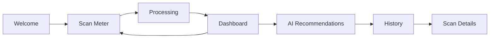
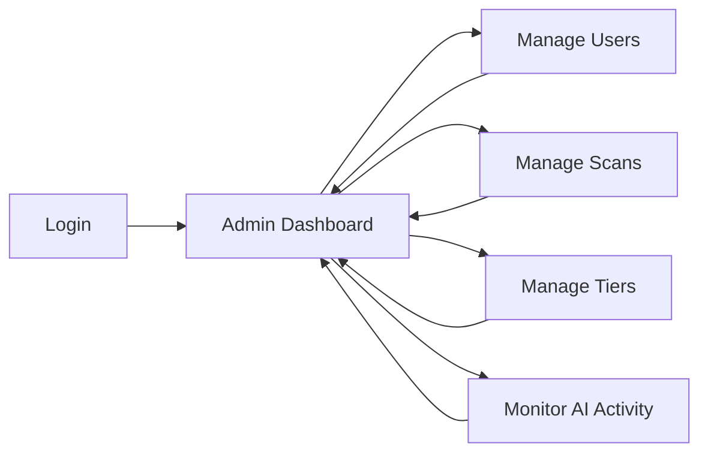

# Kashf Sitemap & Information Architecture

**Product:** Kashf — AI-powered electricity consumption monitoring for Egyptian users  
**Roles:** User, Admin  
**Last updated:** June 2026

---

## 1. Sitemap Diagram

```
/
├── Welcome
├── Scan Meter
├── Processing
├── User Dashboard
├── My Meters
├── Consumption Analytics
├── Bills
├── AI Advisor
├── Alerts
├── Reports
├── Billing
├── Profile
├── History
├── Scan Details
├── Tips & Recommendations
├── About
├── Admin
│   ├── Dashboard
│   ├── Users Management
│   ├── Scan Management
│   ├── Tier Management
│   ├── AI Logs
│   ├── Notifications
│   └── System Settings
└── 404
```

| Route | Page |
|-------|------|
| `/` | Welcome |
| `/login` | Login |
| `/register` | Register |
| `/dashboard` | User Dashboard |
| `/meters` | My Meters |
| `/analytics` | Consumption Analytics |
| `/bills` | Bills |
| `/ai-advisor` | AI Advisor |
| `/alerts` | Alerts |
| `/reports` | Reports |
| `/billing` | Billing |
| `/profile` | Profile |
| `/scan` | Scan Meter |
| `/processing` | Processing |
| `/history` | History |
| `/history/:id` | Scan Details |
| `/tips` | Tips & Recommendations |
| `/about` | About |
| `/admin/dashboard` | Admin Dashboard |
| `/admin/users` | Users Management |
| `/admin/scans` | Scan Management |
| `/admin/tiers` | Tier Management |
| `/admin/ai-logs` | AI Logs |
| `/admin/notifications` | Notifications |
| `/admin/settings` | System Settings |
| `*` | 404 |

---

## 2. Public/User Pages

### Welcome Page

**Route:** `/`

**Purpose:** Introduce Kashf, explain value for Egyptian electricity consumers, and drive users to their first meter scan.

**Target User:** New and returning users (unauthenticated or authenticated).

**Main Sections:**
- Hero section
- Project explanation
- How Kashf works (step-by-step)
- CTA to scan meter
- Feature cards

**Components:**
- `HeroBanner`
- `HowItWorksSteps`
- `FeatureCardGrid`
- `PrimaryCTAButton`
- `Navbar`, `Footer`

**Actions:**
- Navigate to `/scan` (primary CTA)
- Navigate to `/about`
- Sign in / continue to dashboard (if session exists)

**Displayed Data:**
- Marketing copy (Arabic-first, English optional)
- Feature highlights: OCR scan, Sheriha tier, bill estimate, tier warnings, AI tips

**Empty States:** N/A (static marketing page).

**Error States:**
- Failed to load localized content → fallback to default locale
- Optional: degraded hero if assets fail to load

---

### Scan Meter Page

**Route:** `/scan`

**Purpose:** Capture or upload a clear photo of the electricity meter for AI OCR extraction.

**Target User:** Authenticated or guest user performing a scan.

**Main Sections:**
- Camera scanner
- Upload image option
- Scanning guide
- OCR tips

**Components:**
- `CameraCapture`
- `ImageUploader`
- `ScanningGuidePanel`
- `OCRTipsAccordion`
- `CapturePreview`
- `SubmitScanButton`

**Actions:**
- Open device camera
- Select image from gallery/files
- Retake or replace image
- Submit scan → navigate to `/processing`

**Displayed Data:**
- Live camera preview or selected image thumbnail
- Short guide: lighting, angle, meter display visibility
- Accepted formats and max file size

**Empty States:**
- No image selected → show guide and disabled submit until capture/upload

**Error States:**
- Camera permission denied → prompt to enable or use upload
- Unsupported file type or size exceeded → inline validation message
- Upload/network failure → retry with toast

---

### Processing Page

**Route:** `/processing`

**Purpose:** Communicate progress while OCR and AI analyze the meter reading, compute Sheriha tier, bill estimate, and generate tips.

**Target User:** User who just submitted a scan.

**Main Sections:**
- OCR progress
- AI processing progress
- Status indicators

**Components:**
- `ProcessingStepper`
- `ProgressBar` (OCR, tier calculation, tips generation)
- `StatusMessage`
- `CancelOrBackLink` (optional)

**Actions:**
- Auto-redirect to `/dashboard` on success
- Redirect to `/scan` with error context on failure
- Optional: cancel long-running job

**Displayed Data:**
- Current step label (e.g. "Reading meter…", "Calculating Sheriha…", "Generating tips…")
- Percentage or indeterminate spinner per stage
- Scan job ID (internal, not always shown)

**Empty States:** N/A (entered only with active scan job).

**Error States:**
- OCR could not read meter → message + link to rescan at `/scan`
- AI service timeout → retry button
- Invalid reading detected → explain and return to scan

---

### User Dashboard

**Route:** `/dashboard`

**Purpose:** Single view of current consumption, tier (Sheriha), bill estimate, tier-up warnings, and latest AI recommendations.

**Target User:** Authenticated user with at least one successful scan (or onboarding state).

**Main Sections:**
- Current consumption
- Current Sheriha
- Remaining kWh (until next tier threshold)
- Estimated bill
- Consumption gauge
- Warning banner
- AI recommendations
- Consumption chart

**Components:**
- `StatCard`
- `ConsumptionGauge`
- `MonthlyConsumptionTrend`
- `MetersRegistered` (List)
- `RecentActivity`
- `ConsumptionGauge`
- `AIRecommendationPreview`
- `ConsumptionChart` (time series)
- `QuickScanFAB` or link to `/scan`

**Actions:**
- Scan new meter → `/scan`
- View full tips → `/tips`
- Open history → `/history`
- Dismiss or snooze tier warning (persisted in settings)

**Displayed Data:**
- Latest kWh reading and delta since last scan
- Current tier name and bracket
- kWh remaining in current tier before next Sheriha
- Estimated monthly bill (EGP)
- Sparkline or bar chart of consumption over scans
- Top 2–3 AI tips preview

**Empty States:**
- No scans yet → onboarding CTA to `/scan` with short explanation

---

### My Meters Page

**Route:** `/meters`

**Purpose:** Manage electricity meters associated with the user account, add new ones, and view personalized AI Advices for each meter.

**Main Sections:**
- Meter List
- Add/Edit Meter Form (Modal)
- Delete Confirmation (Modal)
- AI Advices View (Modal)

**Components:**
- `MeterFormModal`
- `AIAdvicesModal`
- `MeterCard`

**Displayed Data:**
- Meter alias, reference number, type, active status
- Dynamic translated AI Advices per meter

**Error States:**
- Dashboard data fetch failed → retry + partial cache if available
- Stale scan data → banner prompting new scan

---

### Consumption Analytics Page

**Route:** `/analytics`

**Purpose:** Provide detailed breakdown of electricity usage patterns, AI forecast, and actionable observations based on current meter data.

**Main Sections:**
- Usage trends and history
- Cumulative forecast against predicted usage
- AI Observations and alerts

**Components:**
- `UsageTrendsChart`
- `CumulativeForecastChart`
- `AIObservations`
- `StatCard`

**Displayed Data:**
- Average usage, latest period usage, total consumption
- Bar chart of usage over time
- Area chart for forecast vs actual
- Timeline of AI observations (success, info, warning, alert)

---

### Bills Page

**Route:** `/bills`

**Purpose:** Track monthly billing estimates, forecast upcoming bills, and review historical bill components.

**Main Sections:**
- Estimated current bill forecast
- Breakdown of charges and taxes
- History of previous bills

**Components:**
- `BillForecastSection`
- `BillsTableSection`
- `BillModal`

**Displayed Data:**
- Forecasted EGP amount for current month
- Tax breakdown and customer service fees
- Searchable and paginated list of previous bills

---

### Alerts Page

**Route:** `/alerts`

**Purpose:** Central hub for notifications, tier warnings, billing anomalies, and system announcements.

**Main Sections:**
- Timeline of alerts
- Read/Unread toggles
- Alert actions (Delete, Mark as Read)

**Components:**
- `AlertTimeline` (Timeline-styled view)
- `AlertItem`
- Integration with `alertsSlice`

**Displayed Data:**
- Icon, title, description, timestamp per alert
- Categorization (warning, info, tip)

---

### History Page

**Route:** `/history`

**Purpose:** Browse past scans, consumption trends, bill estimates over time, and tier change events.

**Target User:** Authenticated user.

**Main Sections:**
- Previous scans
- Consumption history
- Bills history
- Tier changes

**Components:**
- `ScanHistoryList`
- `ConsumptionTimeline`
- `BillHistoryTable`
- `TierChangeLog`
- `FilterTabs` (scans / consumption / bills / tiers)
- `Pagination` or infinite scroll

**Actions:**
- Open scan detail → `/history/:id`
- Filter by date range
- Export history (optional future)

**Displayed Data:**
- Scan date, reading (kWh), status, thumbnail
- Per-period consumption deltas
- Estimated bills per billing cycle
- Tier transitions with dates and thresholds crossed

**Empty States:**
- No history → illustration + CTA to first scan at `/scan`

**Error States:**
- List load failure → retry
- Partial page load → skeleton for failed section only

---

### Scan Details Page

**Route:** `/history/:id`

**Purpose:** Show full audit trail for one scan: image, OCR output, tier/bill calculations, and tips generated for that reading.

**Target User:** Authenticated user (owner of scan); admin may use admin scan view.

**Main Sections:**
- Meter image
- OCR result
- Calculations
- Generated AI tips

**Components:**
- `MeterImageViewer`
- `OCRResultPanel` (raw + normalized reading)
- `CalculationBreakdown` (Sheriha, bill line items)
- `ScanTipsList`
- `BackToHistoryLink`
- `RescanButton`

**Actions:**
- Back to `/history`
- Rescan meter → `/scan`
- Share or download report (optional)

**Displayed Data:**
- Uploaded/captured image
- Extracted kWh and confidence score
- Tier at time of scan, estimated bill, consumption since previous scan
- Tips tied to this scan (Egyptian Arabic)

**Empty States:** Invalid or missing `:id` → redirect to `/history` with toast.

**Error States:**
- Scan not found → 404 within app shell
- Unauthorized access → redirect to dashboard

---

### Tips & Recommendations Page

**Route:** `/tips`

**Purpose:** Surface personalized AI electricity-saving advice and general guidance with estimated savings.

**Target User:** Authenticated user.

**Main Sections:**
- Personalized AI tips
- General electricity-saving advice
- Estimated savings

**Components:**
- `PersonalizedTipsFeed`
- `GeneralAdviceSection`
- `SavingsEstimateCard`
- `TipCategoryFilter`
- `MarkTipHelpfulButton`

**Actions:**
- Refresh tips (re-run AI on latest profile)
- Filter by category (AC, lighting, appliances, etc.)
- Navigate to scan if tips are stale

**Displayed Data:**
- Tip title, body (Egyptian Arabic), priority, category
- Estimated kWh or EGP savings per tip where available
- Last updated timestamp

**Empty States:**
- No tips yet → prompt to complete a scan first

**Error States:**
- AI tips generation failed → show cached tips or general advice only + retry

---

### Settings Page

**Route:** `/settings`

**Purpose:** Let users control language, notifications, and appearance.

**Target User:** Authenticated user.

**Main Sections:**
- Language settings
- Notification settings
- Theme settings

**Components:**
- `LanguageSelector` (Arabic / English)
- `NotificationToggles` (tier warning, bill estimate, new tips)
- `ThemeSelector` (light / dark / system)
- `SaveSettingsButton`

**Actions:**
- Change locale → persist and reload strings
- Enable/disable push or in-app notification types
- Switch theme

**Displayed Data:**
- Current preferences
- Optional: linked account email or phone (if auth exists)

**Empty States:** N/A.

**Error States:**
- Save failed → inline error + retry
- Notification permission denied → explain how to enable in OS settings

---

### About Page

**Route:** `/about`

**Purpose:** Build trust and communicate mission, team, values, and answer common questions. Public page linked from Welcome and footer.

**Target User:** All users (authenticated or not).

**Main Sections:**
- Hero (full-viewport, animated scroll indicator)
- Our Story (2-column: story text + colored milestone timeline)
- What Drives Us (4 values cards)
- The Team (photo, name, title, LinkedIn)
- FAQ (animated accordion, 7 questions)
- CTA (Get Started + Contact Us)

**Components (implemented — `src/components/about/`):**
- `AboutHero`
- `AboutStory` (with `TimelineItem`)
- `AboutValues` (with `ValueCard`)
- `AboutTeam` (with `TeamCard`, inline `LinkedinIcon` SVG)
- `AboutFAQ` (with `FAQItem` accordion)
- `AboutCTA`

**i18n:** All strings in `about.*` namespace (en.json + ar.json). RTL layout applied via Tailwind logical properties.

**Actions:**
- Scroll indicator → smooth scroll to story section
- FAQ accordion → expand/collapse
- "Get Started" → `/register`
- "Contact Us" → `mailto:hello@kashf.app`
- LinkedIn cards → open in new tab

**Empty States:** N/A (static content).

**Error States:** i18next falls back to English if locale file fails to load.

---

## 3. Admin Dashboard Pages

### Admin Dashboard

**Route:** `/admin/dashboard`

**Purpose:** Operational overview of platform health, usage, and AI pipeline performance.

**Target User:** Admin role only.

**Main Sections:**
- Total users
- Total scans
- OCR success rate
- AI requests count
- Recent activity
- System health

**Components:**
- `KpiStatCards`
- `OcrSuccessChart`
- `AiRequestVolumeChart`
- `RecentActivityFeed`
- `SystemHealthIndicators`
- `AdminSidebar`, `AdminNavbar`

**Actions:**
- Drill down to users, scans, or AI logs
- Refresh metrics

**Displayed Data:**
- Aggregated counts and rates (24h / 7d / 30d)
- Latest signups, scans, failures
- API latency, error rate, queue depth

**Empty States:** New deployment → zeros with setup checklist link to settings.

**Error States:** Metrics unavailable → degraded dashboard with last-known snapshot

---

### Users Management

**Route:** `/admin/users`

**Purpose:** Search, inspect, and moderate user accounts.

**Target User:** Admin.

**Main Sections:**
- Users table
- Search
- Filters
- User details
- User status

**Components:**
- `UsersDataTable`
- `UserSearchBar`
- `StatusFilter` (active / disabled)
- `UserDetailDrawer` or modal
- `EnableDisableUserActions`

**Actions:**
- View user
- Disable user
- Enable user

**Displayed Data:**
- User ID, name, email/phone, registration date, scan count, last active, status

**Empty States:** No users match filters → clear filters CTA.

**Error States:** Action failed → toast + row unchanged; bulk action partial failure listed

---

### Scan Management

**Route:** `/admin/scans`

**Purpose:** Review all meter scans, OCR outcomes, and moderate problematic uploads.

**Target User:** Admin.

**Main Sections:**
- All scans
- OCR results
- Scan status
- Uploaded images

**Components:**
- `ScansDataTable`
- `OcrConfidenceBadge`
- `ScanStatusChip`
- `ImageThumbnailPreview`
- `ScanDetailModal`

**Actions:**
- View scan
- Delete scan

**Displayed Data:**
- Scan ID, user, timestamp, kWh reading, OCR confidence, status, image URL

**Empty States:** No scans in system or filter → empty table message.

**Error States:** Delete confirmation required; delete failed → error toast

---

### Tier Management

**Route:** `/admin/tiers`

**Purpose:** Maintain Egyptian electricity tier (Sheriha) rules, pricing, and kWh thresholds used in calculations.

**Target User:** Admin.

**Main Sections:**
- Electricity tier rules
- Pricing tables
- Thresholds

**Components:**
- `TiersTable`
- `TierFormModal` (create/edit)
- `PricingGridEditor`
- `ThresholdEditor`

**Actions:**
- Create tier
- Edit tier
- Delete tier

**Displayed Data:**
- Tier order, name (AR/EN), min/max kWh, price per kWh, fixed charges, effective date

**Empty States:** No tiers configured → prompt to create first tier (blocks user bill calc until set).

**Error States:**
- Overlapping thresholds → validation on save
- Delete tier in use → block with explanation

---

### AI Logs

**Route:** `/admin/ai-logs`

**Purpose:** Debug and audit OCR and generative AI requests (e.g. Gemini) for compliance and reliability.

**Target User:** Admin.

**Main Sections:**
- OCR requests
- AI prompts
- AI responses
- Processing times
- Failure logs

**Components:**
- `AiLogsTable`
- `LogDetailPanel` (prompt/response redacted where needed)
- `FailureLogFilter`
- `LatencyHistogram`

**Actions:**
- View log detail
- Filter by type, status, date, user
- Export logs (optional)

**Displayed Data:**
- Request ID, type (OCR / tips / tier assist), timestamp, duration ms, status, error message

**Empty States:** No logs in range → adjust date filter.

**Error States:** Log fetch timeout → paginate with smaller page size

---

### Notifications Management

**Route:** `/admin/notifications`

**Purpose:** Create and manage system announcements and user-targeted notifications.

**Target User:** Admin.

**Main Sections:**
- System announcements
- User notifications

**Components:**
- `NotificationsList`
- `NotificationComposerForm`
- `AudienceSelector` (all users / segment)
- `SchedulePublish` (optional)

**Actions:**
- Create notification
- Edit notification
- Delete notification

**Displayed Data:**
- Title, body, channel (in-app / push), audience, status, sent at

**Empty States:** No notifications → create first announcement CTA.

**Error States:** Publish failed → draft preserved with error reason

---

### System Settings

**Route:** `/admin/settings`

**Purpose:** Configure integrations and platform limits without code deploys.

**Target User:** Admin.

**Main Sections:**
- Gemini API configuration
- OCR settings
- Upload limits
- Security settings

**Components:**
- `ApiKeyMaskedInput`
- `OcrProviderSettings`
- `UploadLimitForm`
- `SecurityPolicyForm`
- `SaveSystemSettingsButton`

**Actions:**
- Save configuration
- Test API connection
- Rotate API keys (masked display)

**Displayed Data:**
- Current env-backed settings (secrets never shown in full)
- Max upload MB, allowed MIME types, rate limits

**Empty States:** First-time setup wizard (optional).

**Error States:**
- Invalid API key on test → inline error
- Save conflict → refresh and retry

---

## 4. Navigation Structure

### User Navigation

Primary nav (persistent on authenticated user shell):

| Label | Route | Icon role |
|-------|-------|-----------|
| Dashboard | `/dashboard` | Home / overview |
| My Meters | `/meters` | Manage user meters |
| Scan Meter | `/scan` | Primary action |
| Analytics | `/analytics` | Consumption charts |
| History | `/history` | Past scans |
| Bills | `/bills` | Consumption bills |
| AI Advisor | `/ai-advisor` | Recommendations |
| Reports | `/reports` | Detailed reports |
| Alerts | `/alerts` | Notification center |
| Billing | `/billing` | Subscription info |
| Profile | `/profile` | User profile |

Secondary / footer links: About (`/about`), Welcome (`/`) for logged-out users.

Mobile: bottom tab bar mirroring the five primary items; Scan emphasized as center FAB where applicable.

### Admin Navigation

Sidebar (collapsible on desktop, drawer on mobile):

| Label | Route |
|-------|-------|
| Dashboard | `/admin/dashboard` |
| Users | `/admin/users` |
| Scans | `/admin/scans` |
| Tiers | `/admin/tiers` |
| AI Logs | `/admin/ai-logs` |
| Notifications | `/admin/notifications` |
| Settings | `/admin/settings` |

Admin entry: separate layout from user app; role guard on all `/admin/*` routes. Link back to user app only for super-admin preview (optional).

---

## 5. Global Components

| Component | Scope | Responsibility |
|-----------|--------|----------------|
| **Navbar** | User app | Brand, primary nav, locale switcher, user menu |
| **Sidebar (Admin)** | Admin app | Section navigation, collapse, active route highlight |
| **Footer** | Public + user | About, privacy, version |
| **Loading States** | Global | Skeletons, spinners, processing steppers |
| **Error States** | Global | Inline errors, full-page error boundary, retry |
| **Toast Notifications** | Global | Success, warning, error feedback |
| **Confirmation Dialogs** | Global | Destructive actions (delete scan, disable user) |
| **AI Assistant Widget** | User app | Contextual help, link to tips, explain Sheriha |

**Layout rules:**
- User routes share `UserLayout` (Navbar + main + Footer).
- Admin routes share `AdminLayout` (Sidebar + AdminNavbar, no marketing footer).
- `/processing` may use minimal chrome (no distractors).
- `404` uses minimal layout with link home.

---

## 6. User Journey

### Primary user flow



1. **Welcome** — User lands on `/`, understands Kashf, taps CTA to scan.
2. **Scan Meter** — User captures or uploads meter at `/scan`.
3. **Processing** — System runs OCR and AI at `/processing`; user sees progress.
4. **Dashboard** — On success, user sees consumption, Sheriha, bill estimate, and tier warning at `/dashboard`.
5. **AI Recommendations** — User opens `/tips` or reads preview cards on dashboard for Egyptian Arabic saving advice.
6. **History** — User reviews past scans and tier changes at `/history`; opens `/history/:id` for detail.

**Branching flows:**
- Tier warning on dashboard → user scans again sooner → repeat Scan → Processing → Dashboard.
- Settings (`/settings`) adjusts language and notifications anytime.
- About (`/about`) accessed from Welcome or footer for trust and privacy.

### Admin flow



1. **Login** — Admin authenticates with elevated role; redirected to `/admin/dashboard`.
2. **Admin Dashboard** — Reviews KPIs, OCR success rate, and system health.
3. **Manage Users** — `/admin/users`: search, view, disable or enable accounts as needed.
4. **Manage Scans** — `/admin/scans`: audit OCR results, view images, delete invalid scans.
5. **Manage Tiers** — `/admin/tiers`: keep Sheriha rules and pricing aligned with Egyptian tariff updates.
6. **Monitor AI Activity** — `/admin/ai-logs`: investigate failures, latency, and prompt/response audit trail.

**Supporting admin tasks:** Notifications (`/admin/notifications`) for announcements; System Settings (`/admin/settings`) for Gemini, OCR, and upload limits.

---

## Appendix: Role & Access Matrix

| Area | User | Admin |
|------|------|-------|
| `/`, `/about`, `/scan` (guest policy TBD) | ✓ | ✓ |
| `/dashboard`, `/history`, `/tips`, `/settings` | ✓ | ✓ (as user preview optional) |
| `/admin/*` | ✗ | ✓ |
| Scan delete | Own data policy TBD | ✓ |
| Tier CRUD | ✗ | ✓ |

---

*This document defines the information architecture for Kashf. Implementation should align routes, components, and role guards with this spec.*
