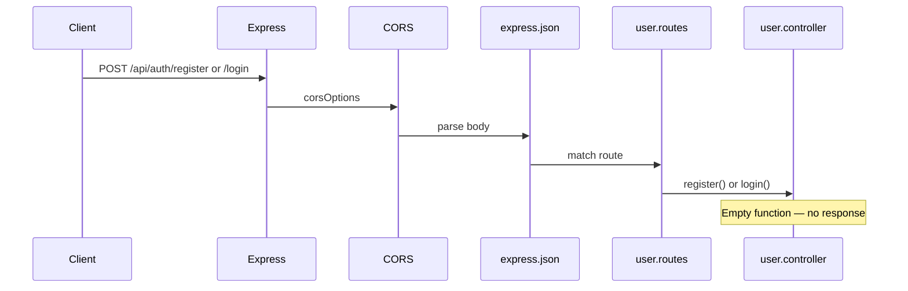
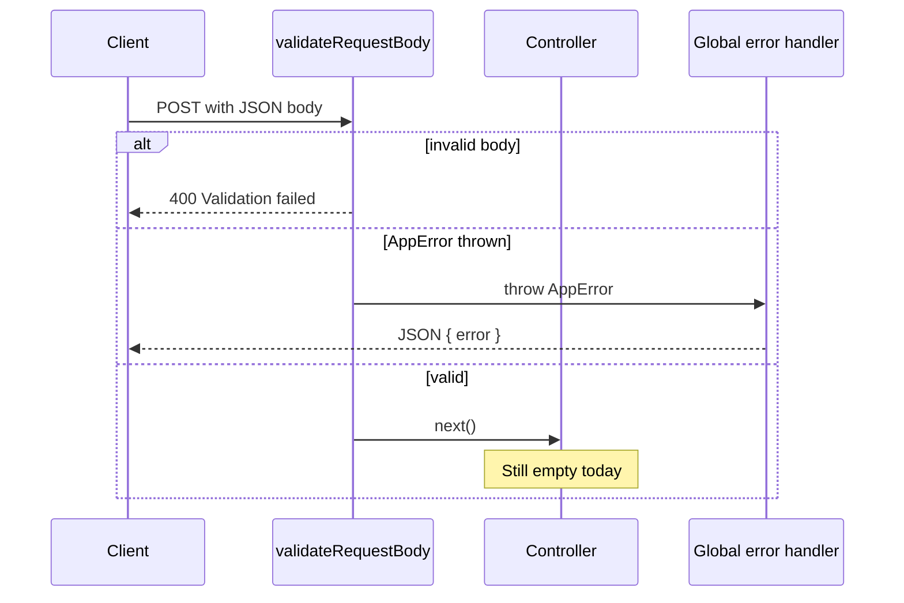

# Backend Services & Middlewares Documentation

**Project:** Kashf Server (`kashf-server`)  
**Stack (implemented):** Node.js, Express 5, MongoDB (Mongoose), Joi, CORS, dotenv  
**Source root:** `server/`  
**Last updated:** June 2025 — generated from current codebase only

---

## 1. Project Architecture Overview

### Folder structure

```
server/
├── server.js                 # Application entry point
├── package.json
├── config/
│   ├── corsOptions.js        # CORS configuration
│   └── startServerWithDB.js  # DB connect + listen with retry
├── database/
│   └── dbConnect.js          # Mongoose connection
├── public/
│   └── views/
│       ├── home.html         # GET / static page
│       └── 404.html          # Unmatched routes HTML response
└── src/
    ├── middlewares/
    │   └── validateRequestBody.js
    ├── modules/
    │   ├── user.routes.js
    │   ├── user.controller.js
    │   └── user.validation.js
    └── utils/
        └── AppError.js
```

### Route organization

- Routes are mounted in `server.js`.
- API routes live under `src/modules/` as feature modules (currently only **user/auth**).
- Auth routes are prefixed with `/api/auth` via `app.use("/api/auth", userRoutes)`.
- Non-API routes: `GET /` serves a static HTML file; unmatched routes hit an inline 404 handler.

### Controller layer

- Controllers exist in `src/modules/user.controller.js`.
- Exported handlers: `register`, `login`.
- Both handlers are **empty** (no request handling, no response, no service calls).

### Service layer

**Planned / Missing Implementation** — No `services/` directory or service modules exist in the repository.

### Database layer

- `database/dbConnect.js` connects Mongoose using `process.env.MONGO_URI`.
- Connection is awaited in `config/startServerWithDB.js` before `app.listen`.
- **Planned / Missing Implementation** — No Mongoose models, schemas, or collection access in `src/`.

### Middleware layer

| Location | Role |
|----------|------|
| `server.js` | `express.json()`, `cors(corsOptions)` |
| `src/middlewares/validateRequestBody.js` | Joi body validation factory (defined, **not registered on any route**) |
| `server.js` | Inline 404 handler (HTML file) |
| `server.js` | Global Express error handler (JSON) |

### Validation layer

- Joi schemas in `src/modules/user.validation.js`: `loginSchema`, `signupSchema`.
- Validation middleware in `src/middlewares/validateRequestBody.js`.
- Schemas are **not imported** by `user.routes.js`; middleware is **not applied** to `/register` or `/login`.

### Error handling strategy

1. **Validation (when middleware is used):** Returns `400` JSON directly from `validateRequestBody` (does not call `next(err)`).
2. **Thrown `AppError`:** Intended for operational errors; passed to global handler via `throw` inside middleware (only if middleware is wired).
3. **Global handler (`server.js`):** Reads `err.statusCode` and `err.message`, responds with `{ error: message }`.
4. **404:** Sends `public/views/404.html` with status `404` (not JSON API shape).
5. **Unhandled errors / empty controllers:** No `asyncHandler` wrapper; empty controllers do not send a response.

**Note on `AppError`:** Constructor signature is `constructor(message, statusCode = 500)`. `validateRequestBody` throws `new AppError(500, "...")` and `new AppError(400, "...")` with arguments reversed relative to that signature (numeric first argument becomes `message`). Document as **current implementation behavior**, not intended API design.

---

## 2. Registered API Endpoints

Only endpoints explicitly registered in `server.js` and `user.routes.js` are listed below.

---

### Home (static)

**Method:** `GET`  
**Route:** `/`  
**Authentication Required:** No  
**Authorization Required:** No  
**Controller:** Inline handler in `server.js`  
**Service:** None  
**Validation:** None  
**Middlewares Applied:** `express.json()`, `cors(corsOptions)` (global)

#### Request

| Part | Details |
|------|---------|
| Headers | None required |
| Params | None |
| Query | None |
| Body | None |

#### Response

| Case | Format |
|------|--------|
| Success | HTML file `public/views/home.html` (`res.sendFile`) |
| Error | Not defined in code for this route |

#### Business Flow

1. Request hits `GET /` in `server.js`.
2. `sendFile` resolves `public/views/home.html` relative to `server/` directory.
3. HTML response returned.

---

### Register

**Method:** `POST`  
**Route:** `/api/auth/register`  
**Authentication Required:** No  
**Authorization Required:** No  
**Controller:** `user.controller.register`  
**Service:** None  
**Validation:** `signupSchema` exists in `user.validation.js` but is **not applied**  
**Middlewares Applied:** `express.json()`, `cors(corsOptions)` only

#### Request

| Part | Details |
|------|---------|
| Headers | `Content-Type: application/json` expected for body parsing (not enforced in route) |
| Params | None |
| Query | None |
| Body | **Not validated at route level.** Intended schema (if middleware were wired): see [signupSchema](#signupschema) |

#### Response

| Case | Format |
|------|--------|
| Success | **Planned / Missing Implementation** — controller body is empty; no `res.json` or status sent |
| Error | **Planned / Missing Implementation** — no controller error handling |

#### Business Flow

1. Request reaches `app.use("/api/auth", userRoutes)`.
2. `router.post("/register", userController.register)` matches.
3. Global middleware already parsed JSON body into `req.body`.
4. No validation middleware runs.
5. `register` async function runs with **no logic**.
6. **No response is sent** (client may hang until timeout).

---

### Login

**Method:** `POST`  
**Route:** `/api/auth/login`  
**Authentication Required:** No  
**Authorization Required:** No  
**Controller:** `user.controller.login`  
**Service:** None  
**Validation:** `loginSchema` exists but is **not applied**  
**Middlewares Applied:** `express.json()`, `cors(corsOptions)` only

#### Request

| Part | Details |
|------|---------|
| Headers | `Content-Type: application/json` expected for body parsing |
| Params | None |
| Query | None |
| Body | **Not validated at route level.** Intended schema (if middleware were wired): see [loginSchema](#loginschema) |

#### Response

| Case | Format |
|------|--------|
| Success | **Planned / Missing Implementation** — controller body is empty |
| Error | **Planned / Missing Implementation** — no controller error handling |

#### Business Flow

1. Request reaches `/api/auth`.
2. `router.post("/login", userController.login)` matches.
3. No validation middleware runs.
4. `login` async function runs with **no logic**.
5. **No response is sent**.

---

### Unmatched routes (Not Found)

**Method:** Any  
**Route:** Any path not matched above  
**Authentication Required:** No  
**Authorization Required:** No  
**Controller:** Inline middleware in `server.js`  
**Service:** None  
**Validation:** None  
**Middlewares Applied:** Runs after route matching fails

#### Request

Any method/path.

#### Response

| Case | Format |
|------|--------|
| Not found | Status `404`, HTML file `public/views/404.html` |

#### Business Flow

1. No route matches.
2. 404 middleware sends HTML 404 page.

---

## 3. Route Groups

### Auth Routes

| Method | Route | Controller | Status |
|--------|-------|------------|--------|
| `POST` | `/api/auth/register` | `register` | Registered; **handler not implemented** |
| `POST` | `/api/auth/login` | `login` | Registered; **handler not implemented** |

### User Routes

**Planned / Missing Implementation** — No `/api/users` or user profile routes in codebase.

### Scan Routes

**Planned / Missing Implementation** — No scan/OCR/upload routes.

### Dashboard Routes

**Planned / Missing Implementation** — No dashboard aggregation API routes.

### History Routes

**Planned / Missing Implementation** — No history or scan-detail API routes.

### Admin Routes

**Planned / Missing Implementation** — No `/api/admin/*` routes.

### Notification Routes

**Planned / Missing Implementation** — No notification routes.

### Settings Routes

**Planned / Missing Implementation** — No settings/system configuration API routes.

### AI Routes

**Planned / Missing Implementation** — No Gemini or AI tip generation routes (README mentions AI; not implemented in server).

### OCR Routes

**Planned / Missing Implementation** — No OCR processing routes.

### Static / Root

| Method | Route | Handler |
|--------|-------|---------|
| `GET` | `/` | `home.html` |

---

## 4. Middlewares

### express.json()

**File Location:** `server/server.js` (built-in Express middleware)  
**Purpose:** Parse JSON request bodies into `req.body`  
**Execution Order:** 1 (first `app.use`)  
**Used By:** All routes

#### Logic

Parses `Content-Type: application/json` bodies. Required for auth endpoints to receive JSON payloads.

---

### cors (with corsOptions)

**File Location:** `server/server.js` → `config/corsOptions.js`  
**Purpose:** Cross-Origin Resource Sharing  
**Execution Order:** 2  
**Used By:** All routes

#### Logic

- `origin`: callback always invokes `callback(null, true)` — **all origins allowed** (allowlist commented out).
- `credentials: true` — allows cookies/authorization headers in CORS requests.
- Commented code shows intended `allowedOrigins` restriction (`localhost:8080`, production domain) — **not active**.

---

### validateRequestBody

**File Location:** `src/middlewares/validateRequestBody.js`  
**Purpose:** Factory that returns middleware validating `req.body` with a Joi schema  
**Execution Order:** Would run per-route if registered (currently **unused**)  
**Used By:** **None** (not imported in `user.routes.js`)

#### Logic

1. If `validationSchema` argument is missing → `throw new AppError(500, "Validation schema is required for this route.")`.
2. If `req.body` is empty or has no keys → `throw new AppError(400, "Please provide data in the request body.")`.
3. If `req.body` is not an object → `throw new AppError(400, "Invalid data format. Please send a JSON object.")`.
4. Runs `validationSchema.validate(requestData, { abortEarly: false })`.
5. On Joi error → responds `400` with:

```json
{
  "message": "Validation failed.",
  "details": [
    { "field": "<first path segment>", "message": "<joi message>" }
  ]
}
```

6. On success → `next()`.

---

### Not Found handler (inline)

**File Location:** `server/server.js`  
**Purpose:** Serve HTML 404 for unmatched routes  
**Execution Order:** After all routes  
**Used By:** Any unmatched request

#### Logic

`res.status(404).sendFile(...404.html)`.

---

### Global error handler (inline)

**File Location:** `server/server.js`  
**Purpose:** Catch errors passed to `next(err)` or synchronous throws in middleware (Express 5 error handling)  
**Execution Order:** Last middleware  
**Used By:** Errors that reach Express error pipeline

#### Logic

```javascript
const { statusCode, message } = err;
res.status(statusCode || 500).json({
  error: message || "Internal Server Error"
});
```

**Not present in codebase:** `authenticateUser`, `authorizeAdmin`, `uploadImage`, `rateLimiter`, `asyncHandler`, `notFoundHandler` (separate module), `logger`, `helmet`, `multer`, dedicated `errorHandler` module.

---

## 5. Validation Schemas

Defined in `src/modules/user.validation.js` (Joi). **Not wired to routes.**

### loginSchema

**Used By:** **None** (intended for `POST /api/auth/login` — not connected)  
**Fields:**

| Field | Rules |
|-------|--------|
| `email` | `Joi.string().email().required()` |
| `password` | `Joi.string().min(6).max(100).required()` |
| `role` | `Joi.string().valid("user", "admin").default("user")` |

**Custom Rules:** None beyond Joi built-ins.  
**Commented field:** `username` pattern rule is commented out in file.  
**Error Messages:** Default Joi messages (via `validateRequestBody` → `details[].message`).

---

### signupSchema

**Used By:** **None** (intended for `POST /api/auth/register` — not connected)  
**Fields:**

| Field | Rules |
|-------|--------|
| `username` | `Joi.string().pattern(/^[a-zA-Z0-9-]+( [a-zA-Z0-9-]+)?$/).min(3).max(200).required()` |
| `email` | `Joi.string().email().required()` |
| `password` | `Joi.string().min(6).max(100).required()` |
| `repassword` | `Joi.ref("password")` (must match `password`; Joi default equality) |
| `role` | `Joi.string().valid("user", "admin").default("user")` |

**Custom Rules:** Username alphanumeric/hyphen pattern with optional single internal space group.  
**Error Messages:** Default Joi messages when middleware is used.

---

## 6. Error Handling

### Global error handler

- **Location:** `server.js` (inline, 4-argument middleware).
- **Response shape:**

```json
{
  "error": "<message string or 'Internal Server Error'>"
}
```

- **Status:** `err.statusCode` or `500`.

### Not found handler

- **Location:** `server.js` (3-argument middleware before error handler).
- **Response:** HTML (`404.html`), status `404` — not JSON.

### Custom error classes

**AppError** (`src/utils/AppError.js`):

```javascript
class AppError extends Error {
  constructor(message, statusCode = 500) {
    super(message);
    this.statusCode = statusCode;
  }
}
```

Only referenced by `validateRequestBody` (currently unused on routes).

### Validation errors

When `validateRequestBody` runs and Joi fails:

```json
{
  "message": "Validation failed.",
  "details": [
    { "field": "email", "message": "\"email\" must be a valid email" }
  ]
}
```

Status: `400`. Does not use global error handler.

### Authentication errors

**Planned / Missing Implementation** — No auth middleware or auth-specific error responses.

### Authorization errors

**Planned / Missing Implementation** — No role-based guards.

### Database errors

- `dbConnect` logs connection errors to console; rethrows via `startServerWithDB` catch.
- Server retries connection up to **5 times** with **5 second** delay between attempts.
- No HTTP-layer database error formatter for API routes.

---

## 7. Authentication & Authorization Flow

### Current implementation

| Concern | Status |
|---------|--------|
| JWT | **Not implemented** (no `jsonwebtoken` dependency) |
| Session | **Not implemented** |
| Cookies / sessions | CORS allows `credentials: true`; no cookie parser or session store |
| Token generation | **Not implemented** |
| Token verification | **Not implemented** |
| Protected routes | **None** |
| Admin-only routes | **None** |

`loginSchema` / `signupSchema` include optional `role` field (`user` | `admin`) but no enforcement exists.

### Request lifecycle (current auth routes)



### Request lifecycle (if validation were wired — not current)



---

## 8. File Upload Flow

**Planned / Missing Implementation**

- No upload middleware (no `multer` or similar).
- No storage provider configuration.
- No file size, MIME type, or image processing routes in `server/`.

---

## 9. Service Layer Documentation

**Planned / Missing Implementation** — No service files exist under `server/src/`.

The following are **not** present:

- User service (registration, login, password hashing)
- Scan / OCR service
- Dashboard / consumption service
- Admin service
- Notification service
- AI / Gemini integration service

---

## 10. Missing or Planned Features

Cross-reference with frontend IA (`docs/01-sitemap-and-information-architecture.md`) and root `README.md`: many capabilities are described at product level but **not implemented** in the backend repository.

---

# Planned / Missing Implementation

### Routes & handlers

| Item | Evidence | Notes |
|------|----------|-------|
| `register` controller logic | Empty function in `user.controller.js` | No user creation, no response |
| `login` controller logic | Empty function | No credential check, no token |
| Validation on auth routes | Schemas exist; routes omit `validateRequestBody` | `signupSchema` / `loginSchema` unused |
| User CRUD / profile APIs | Not in repo | — |
| Scan / meter upload APIs | Not in repo | — |
| Dashboard / consumption APIs | Not in repo | — |
| History / scan detail APIs | Not in repo | — |
| Admin APIs | Not in repo | — |
| Notifications APIs | Not in repo | — |
| Settings / tier management APIs | Not in repo | — |
| AI / Gemini APIs | Not in repo | README mentions Gemini |
| OCR APIs | Not in repo | — |

### Layers & infrastructure

| Item | Status |
|------|--------|
| Service layer (`src/services/`) | Missing |
| Mongoose models / schemas | Missing (mongoose installed, no models) |
| Authentication middleware | Missing |
| Authorization / admin guard | Missing |
| Password hashing (e.g. bcrypt) | Missing |
| JWT or session library | Missing |
| `asyncHandler` / centralized async error wrapper | Missing |
| Dedicated `notFoundHandler` JSON API | Missing (HTML 404 only) |
| `helmet`, `rateLimiter`, `logger` | Missing |
| File upload (`multer`, storage) | Missing |
| Environment template (`.env.example`) | Missing (`.env` gitignored; `MONGO_URI`, `PORT` used in code) |

### Configuration & CORS

| Item | Status |
|------|--------|
| Origin allowlist | Commented out; all origins allowed |
| `allowedOrigins` enforcement | Not active |

### Wiring gaps (exists but unused)

| File | Issue |
|------|-------|
| `user.validation.js` | Not imported by `user.routes.js` |
| `validateRequestBody.js` | Not applied to any route |
| `AppError` | Only used in unused validation middleware; argument order inconsistent with constructor |

### Dependencies installed vs used

| Package | Used in code |
|---------|----------------|
| `express` | Yes |
| `cors` | Yes |
| `dotenv` | Yes (`dotenv.config()` in `server.js`) |
| `mongoose` | Yes (`dbConnect` only) |
| `joi` | Yes (`user.validation.js` only) |

---

## Appendix: Environment variables

| Variable | Used in | Default |
|----------|---------|---------|
| `MONGO_URI` | `database/dbConnect.js` | None (required for connection) |
| `PORT` | `server.js` | `3000` |

---

## Appendix: Server startup flow

1. `server.js` creates Express app, loads `dotenv`, registers global middleware and routes.
2. IIFE calls `startServerWithDB(app, PORT)`.
3. `dbConnect()` attempts `mongoose.connect(process.env.MONGO_URI)`.
4. On success → `app.listen(PORT)`.
5. On failure → retry up to 5 times, 5 seconds apart; logs error.

---

*This document reflects only files under `server/` as of the generation date. Do not infer endpoints or middleware beyond what is registered or defined in source.*
