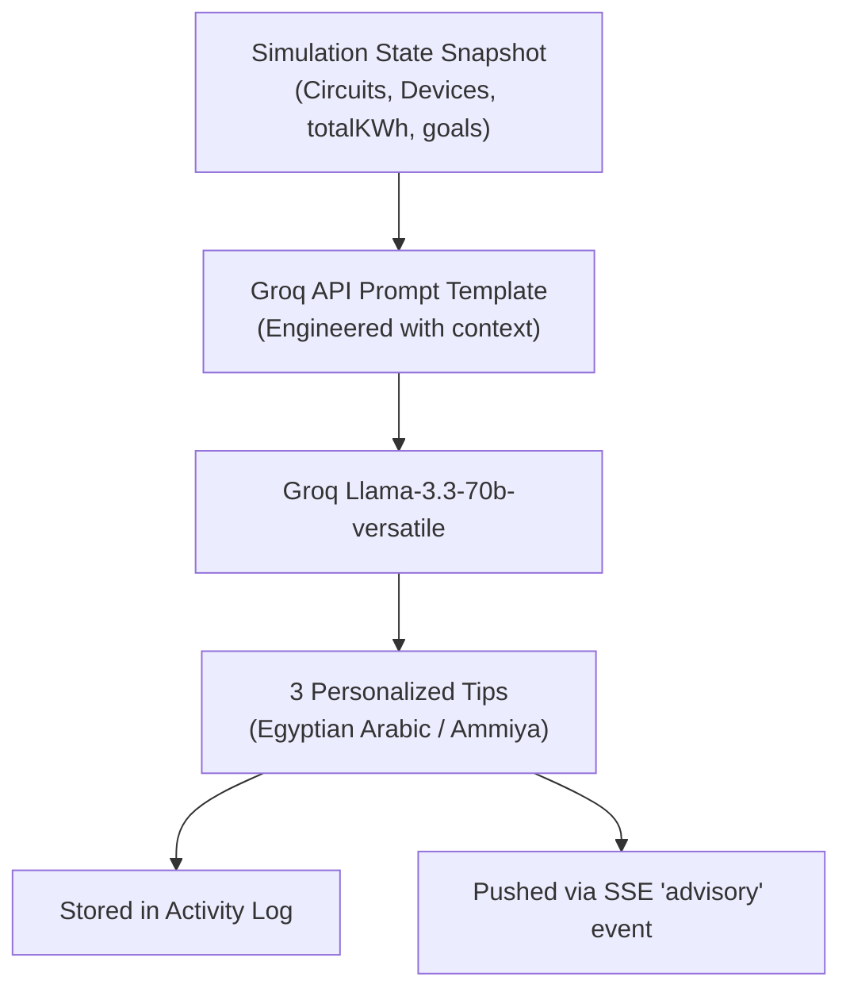
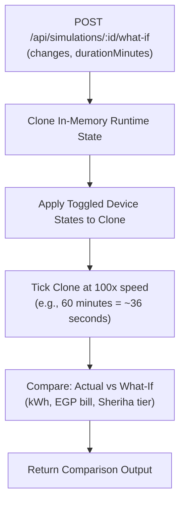
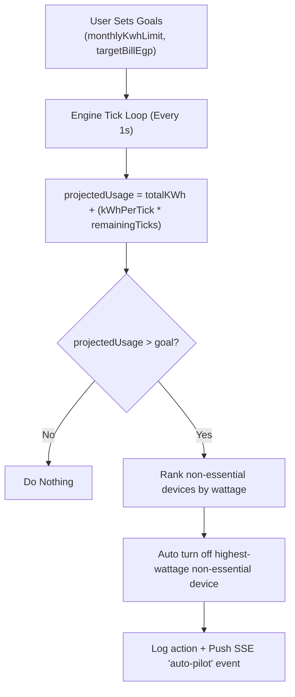
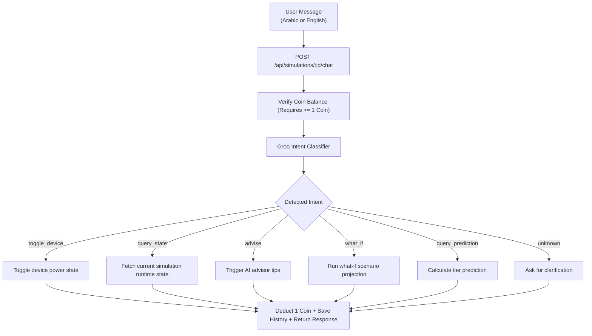
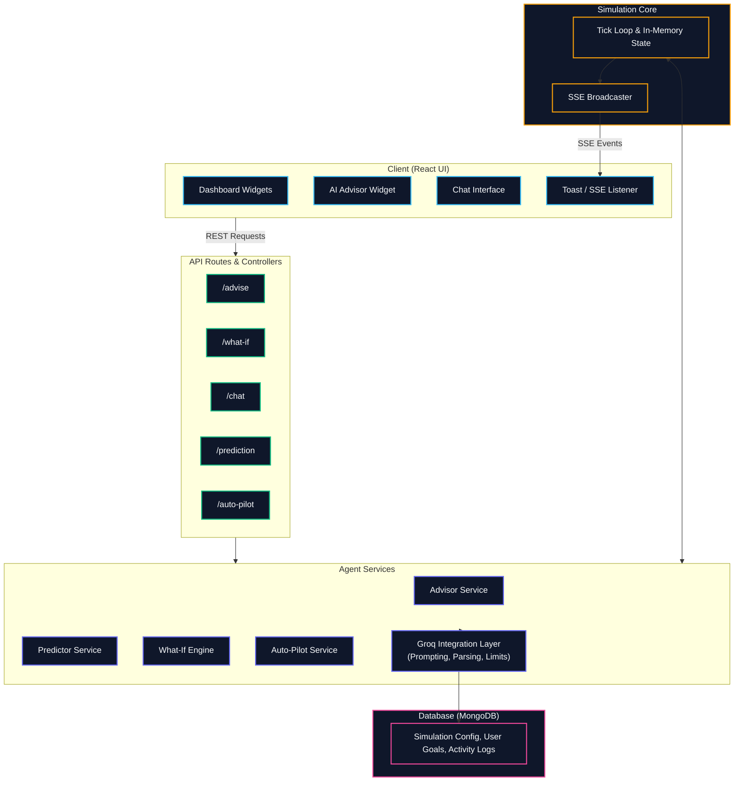

# AI Agents & Intelligent Features

The Simulation Engine generates rich real-time data — circuit loads, device states, consumption curves, tier progression. This document explores how AI (Groq API) and autonomous agents can transform that raw data into personalized, actionable value for Egyptian households.

All agents build on the existing Kashf infrastructure: Groq API integration, user consumption goals, activity logging, and the simulation engine's tick loop.

---

## 1. AI Consumption Advisor

On-demand or periodic personalized tips generated by Groq, tailored to the user's live consumption pattern.

### Trigger points

- **On-demand:** `POST /api/simulations/:id/advise` — user clicks "Get Advice" in dashboard
- **Periodic:** Engine emits an `advisory-trigger` event every 30 ticks (configurable)
- **Event-driven:** When crossing a tier threshold or detecting a sudden load spike

### Flow



### Prompt template (Groq)

```
You are an energy-saving advisor for Egyptian homes.
The user's current consumption:

- Total: {totalKWh} kWh
- Current tier: {currentTier}
- Estimated bill: {estimatedBill} EGP
- Monthly goal: {goalKWh} kWh

Circuits:
{circuits table: name, loadW, top device}

Generate exactly 3 practical tips in Egyptian Arabic.
Each tip must:
1. Reference a specific device or circuit
2. State the estimated savings in EGP or kWh
3. Be actionable (not generic)

Format each tip as:
- **الجهاز**: {device name}
- **النصيحة**: {tip in Arabic}
- **التوفير**: {savings}
```

### Implemented endpoint

| Method | Endpoint | Description |
| :--- | :--- | :--- |
| `POST` | `/api/simulations/:id/advise` | Get AI-generated tips for current state |

### Response shape

```json
{
  "success": true,
  "data": {
    "tips": [
      {
        "device": "تكييف غرفة المعيشة",
        "advice": "لو خفضت درجة حرارة التكييف من 24 لـ 26 هتوفر حوالي 30% من استهلاكه",
        "savings": "45 EGP/شهر"
      }
    ],
    "generatedAt": "2026-06-10T..."
  }
}
```

---

## 2. Tier Prediction Agent

Proactively warns the user before they cross into a more expensive Sheriha tier.

### How it works

The agent tracks consumption velocity:

```
rollingKWhPerMinute = (totalKWh now - totalKWh 1 min ago)
remainingKWh = tierThreshold[currentTier] - totalKWh
estimatedTimeToNextTier = remainingKWh / (rollingKWhPerMinute * 60)  // in hours
```

### Alert thresholds

| Warning level | Trigger | Action |
| :--- | :--- | :--- |
| Green | > 20% remaining | No action |
| Yellow | ≤ 20% remaining | Push notification + dashboard warning |
| Orange | ≤ 10% remaining | Suggest auto-pilot mode |
| Red | ≤ 5% remaining | Urgent alert + activate what-if simulation |

### Implemented endpoint

| Method | Endpoint | Description |
| :--- | :--- | :--- |
| `GET` | `/api/simulations/:id/prediction` | Get tier prediction data |

### Response shape

```json
{
  "success": true,
  "data": {
    "currentTier": 3,
    "nextTier": 4,
    "remainingKWh": 25.5,
    "estimatedHoursToNextTier": 12.3,
    "warningLevel": "yellow",
    "rollingConsumptionKWhPerHour": 2.07
  }
}
```

### Integration

- The prediction engine runs in the background alongside the simulation engine
- On every tick, it checks thresholds and emits `tier-warning` SSE events when crossing levels
- Warnings are also logged via the existing activity service

---

## 3. What-If Simulation Agent

Lets users ask "what if I turn this device off?" and get a concrete answer without waiting for real-time.

### Flow



### Comparison output

| Metric | Current | What-If | Difference |
| :--- | :--- | :--- | :--- |
| Total kWh | 150.00 | 135.00 | -15.00 |
| Estimated bill | 122.00 EGP | 108.00 EGP | -14.00 EGP |
| Current tier | 3 | 3 | — |
| Tier after 60 min | 3 | 3 | — |

### Implemented endpoint

| Method | Endpoint | Description |
| :--- | :--- | :--- |
| `POST` | `/api/simulations/:id/what-if` | Run a fast-forward prediction |

### Use cases

- "What if I turn off the AC and use a fan instead?"
- "What if I add a 2000W heater in the winter?"
- "What if I run the washing machine at night?"
- "How much will my bill drop if I replace all lights with LEDs?"

---

## 4. Auto-Pilot Agent

An autonomous mode that manages devices to keep the user within their consumption goals. The user sets a target (monthly kWh limit or bill target) and the agent adjusts device states to stay on track.

### How it works



### Essential device marking

Users can mark devices as "essential" (e.g., refrigerator, router) so auto-pilot never touches them.

```json
{
  "deviceId": "...",
  "essential": true,
  "priority": 1
}
```

### Implemented endpoints

| Method | Endpoint | Description |
| :--- | :--- | :--- |
| `POST` | `/api/simulations/:id/auto-pilot/start` | Enable auto-pilot with current goals |
| `POST` | `/api/simulations/:id/auto-pilot/stop` | Disable auto-pilot |
| `PATCH` | `/api/simulations/:id/devices/:did` | Add `essential` flag to device (reuses existing endpoint) |

### Auto-pilot SSE events

```
event: auto-pilot
data: {"action": "turned_off", "device": "Water Heater", "savedWattage": 1500, "reason": "projected_over_goal"}
```

---

## 5. Natural Language Agent

A chat interface that lets users control the simulation and ask questions in plain language (Arabic or English).

### Architecture



### Supported intents

| Intent | Example | Action |
| :--- | :--- | :--- |
| `toggle_device` | "شغل المروحة في المكتب" | Toggle device ON/OFF |
| `add_device` | "ضيف دفاية 1500 وات في غرفة النوم" | Create device |
| `query_state` | "كم استهلاكي النهاردة؟" | Return summary |
| `query_prediction` | "أمتى هتعدي الشريحة الرابعة؟" | Return tier prediction |
| `advise` | "إزاي أوفر في فاتورة الكهربا؟" | Get AI tips |
| `what_if` | "لو فصلت السخان ساعة هتفرق قد إيه؟" | Run what-if |
| `auto_pilot` | "خلّي البيت يوفر لنفسه" | Enable auto-pilot |
| `set_goal` | "عاوز الفاتورة متعديش 200 جنيه" | Update consumption goal |

### Chatbot Coin Deduction & Concurrency Control

Each chatbot message sent to `/api/simulations/:id/chat` consumes **1 AI Coin**.
1. **Deduction Priority:** Coins are first deducted from the user's base monthly `coins` balance. If exhausted, they are deducted from the accumulated `rolloverCoins` balance.
2. **Pre-Flight Validation:** If the user has a total coin balance (`coins` + `rolloverCoins`) of `< 1`, the API throws a `400 Bad Request` with an "Insufficient coins" message.
3. **Idempotency (Deduplication):** To prevent multiple coin deductions for duplicate or retried requests, the client generates a unique `messageId` per message. The backend caches the result of each processed message for 5 minutes. If a duplicate `messageId` is received, the cached response is returned immediately without re-invoking the AI model or deducting further coins.
4. **Race Condition Prevention:** Requests are serialized per user using an in-memory lock queues. This ensures concurrent requests from the same user are queued and processed sequentially, eliminating race conditions or out-of-order balance modifications.

### Implemented endpoint

| Method | Endpoint | Description |
| :--- | :--- | :--- |
| `POST` | `/api/simulations/:id/chat` | Natural language interaction |

**Request Body:**
```json
{
  "message": "شغل التكييف في غرفة النوم",
  "messageId": "1718534012345"
}
```

### Response shape

```json
{
  "success": true,
  "data": {
    "reply": "تم تشغيل مكيف غرفة النوم. الاستهلاك الحالي: 3700 واط",
    "intent": "toggle_device",
    "actionTaken": true,
    "actionResult": {
      "device": "AC Unit",
      "isOn": true,
      "loadW": 3700
    },
    "coins": 49,
    "rolloverCoins": 12
  }
}
```

---

## 6. Smart Recommendations Engine

A passive agent that generates recommendations based on patterns and history — no user prompt required.

### Recommendation categories

| Category | Example | Trigger |
| :--- | :--- | :--- |
| **Peak detection** | "لاحظنا أن استهلاكك بيزيد في الفترة من 6 لـ 8 المغرب" | Daily pattern analysis |
| **Anomaly** | "الاستهلاك النهاردة أعلى 40% من المتوسط" | Sudden deviation from baseline |
| **Comparison** | "بيتك أقل استهلاك من 75% من البيوت المماثلة" | Percentile-based |
| **Seasonal** | "مع دخول الصيف، نتوقع زيادة 30% في الاستهلاك" | Time-based + historical |
| **Budget** | "أنت في طريقك تتعدى الميزانية الشهرية بـ 50 جنيه" | Projected vs goal |

### Integration

- Runs as a daily cron job or event-driven after significant state changes
- Stores recommendations in the activity log
- Pushes to dashboard via SSE notifications channel

---

## 7. Architecture & Integration Map



---

## 8. Implemented Endpoints Summary

| Method | Endpoint | Agent | Description |
| :--- | :--- | :--- | :--- |
| `POST` | `/api/simulations/:id/advise` | Advisor | Get AI-generated tips |
| `GET` | `/api/simulations/:id/prediction` | Predictor | Get tier prediction data |
| `POST` | `/api/simulations/:id/what-if` | What-If | Run fast-forward prediction |
| `POST` | `/api/simulations/:id/auto-pilot/start` | Auto-Pilot | Enable autonomous mode |
| `POST` | `/api/simulations/:id/auto-pilot/stop` | Auto-Pilot | Disable autonomous mode |
| `POST` | `/api/simulations/:id/chat` | NL Agent | Natural language interaction |
| `PATCH` | `/api/simulations/:id/devices/:did` | — | Add `essential` flag (extend existing) |

---

## 9. Implementation Analysis & Resource Overhead

| Agent Feature | API Calls | CPU / Memory Overhead | User Cost | Status |
| :--- | :--- | :--- | :--- | :--- |
| **AI Consumption Advisor** | Groq API | Low (On-demand prompt) | Free | 🟢 Implemented |
| **Tier Prediction Agent** | Math-based | Low (Pure mathematical projection) | Free | 🟢 Implemented |
| **Smart Recommendations** | Groq API | Medium (Historical log analysis) | Free | 🟢 Implemented |
| **What-If Agent** | In-Memory Clone | High (Fast-forward tick projection) | Free | 🟢 Implemented |
| **Natural Language Agent** | Groq API | High (Intent classifier and parser) | 1 AI Coin | 🟢 Implemented |
| **Auto-Pilot Agent** | Rule-based | Low (Real-time goal checking) | Free | 🟢 Implemented |
