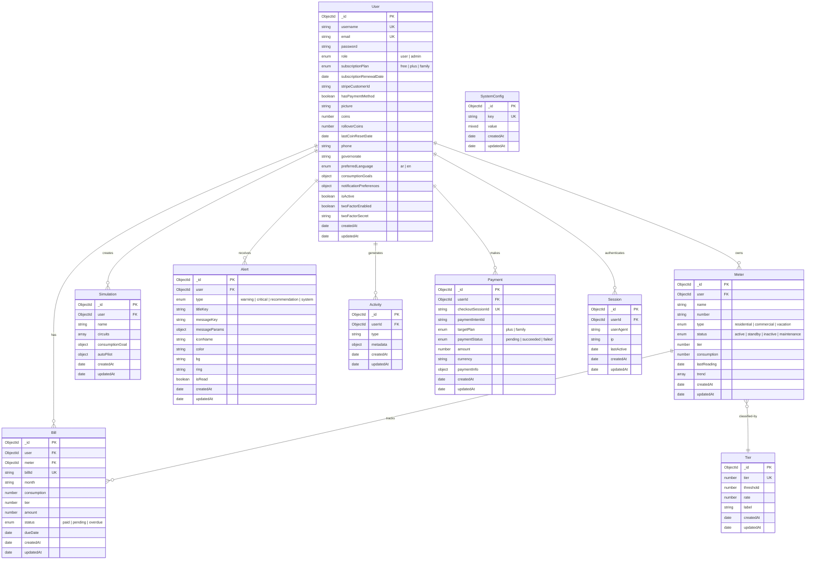

# Database Schema Diagrams

Entity-Relationship diagrams for the Kashf MongoDB database.

---

## Entity-Relationship Overview



---

## Collection Details

### Users

Central identity document. Stores authentication, profile, subscription, preferences, and security fields.

| Field | Type | Notes |
|-------|------|-------|
| `_id` | ObjectId | Auto-generated |
| `username` | String | Unique, required |
| `email` | String | Unique, required |
| `password` | String | `select: false` — excluded from queries by default |
| `role` | String | `user` \| `admin` |
| `subscriptionPlan` | String | `free` (50 coins) \| `plus` (150 coins) \| `family` (300 coins) |
| `coins` | Number | Default 50; never below 0 |
| `consumptionGoals` | Object | `{ monthlyKwhLimit, targetBillEgp, targetSheriha }` |
| `notificationPreferences` | Object | Toggle flags for 7 notification types |
| `twoFactorEnabled` | Boolean | TOTP-based 2FA |

### Meters

Linked to a user; consumption derived from linked bills or synthetic trends.

| Field | Type | Notes |
|-------|------|-------|
| `user` | ObjectId | FK → User |
| `name` | String | Required |
| `number` | String | Required; unique per user (compound index) |
| `type` | String | `residential` \| `commercial` \| `vacation` |
| `status` | String | `active` \| `standby` \| `inactive` \| `maintenance` |
| `trend` | [Number] | 5-point consumption trend array |
| `consumption` | Number | Latest consumption value |

### Bills

Manual consumption entries linked to a meter and user.

| Field | Type | Notes |
|-------|------|-------|
| `user` | ObjectId | FK → User |
| `meter` | ObjectId | FK → Meter (optional) |
| `billId` | String | Auto-generated `INV-YYXXXX` — unique |
| `month` | String | e.g. `"January 2026"` |
| `consumption` | Number | kWh reading |
| `tier` | Number | 1–7 |
| `amount` | Number | EGP amount |
| `status` | String | `paid` \| `pending` \| `overdue` |

### Simulations

Virtual appliance sandbox for what-if analysis and AI advice.

| Field | Type | Notes |
|-------|------|-------|
| `user` | ObjectId | FK → User (indexed) |
| `name` | String | Default `"New Simulation"` |
| `circuits` | [Circuit] | Embedded sub-documents with nested `[Device]` |
| `consumptionGoal` | Object | `{ monthlyKwhLimit, targetBillEgp }` |
| `autoPilot` | Object | `{ enabled, startedAt, actionsTaken }` |

#### Embedded Circuit Schema

```
Circuit {
  _id: ObjectId
  name: String          // e.g. "Kitchen"
  devices: [Device]
}

Device {
  _id: ObjectId
  name: String          // e.g. "Refrigerator"
  wattage: Number       // Watts
  isOn: Boolean
  essential: Boolean    // Protected from auto-pilot
}
```

### Tiers

Sheriha pricing rules (Egyptian tariff brackets).

| Field | Type | Notes |
|-------|------|-------|
| `tier` | Number | 1–7, unique |
| `threshold` | Number | kWh ceiling for this tier |
| `rate` | Number | Price per kWh (EGP) |
| `label` | String | Optional display name |

### Alerts

User-facing notifications with i18n support.

| Field | Type | Notes |
|-------|------|-------|
| `user` | ObjectId | FK → User |
| `type` | String | `warning` \| `critical` \| `recommendation` \| `system` |
| `titleKey` | String | i18n translation key |
| `messageKey` | String | i18n translation key |
| `messageParams` | Mixed | Interpolation values for the translated string |
| `isRead` | Boolean | Default `false` |

### Activity

Audit log with TTL (auto-delete after 90 days).

| Field | Type | Notes |
|-------|------|-------|
| `userId` | ObjectId | FK → User (indexed) |
| `type` | String | Enum from `activity.constants.js` |
| `metadata` | Mixed | Flexible payload |
| `createdAt` | Date | TTL index: `expireAfterSeconds: 90 * 86400` |

### Payments

Stripe checkout tracking.

| Field | Type | Notes |
|-------|------|-------|
| `userId` | ObjectId | FK → User |
| `checkoutSessionId` | String | Unique Stripe session ID |
| `paymentIntentId` | String | Stripe payment intent |
| `targetPlan` | String | `plus` \| `family` |
| `paymentStatus` | String | `pending` \| `succeeded` \| `failed` |
| `amount` | Number | EGP |

### Sessions

Device session tracking with TTL (auto-delete after 7 days).

| Field | Type | Notes |
|-------|------|-------|
| `userId` | ObjectId | FK → User (indexed) |
| `userAgent` | String | Device identifier |
| `ip` | String | Client IP |
| `lastActive` | Date | Updated on each token refresh |

### SystemConfig

Generic key-value store for system settings.

| Field | Type | Notes |
|-------|------|-------|
| `key` | String | Unique setting key |
| `value` | Mixed | Any JSON-serializable value |

---

## Indexes Summary

| Collection | Index | Type |
|------------|-------|------|
| User | `username` | Unique |
| User | `email` | Unique |
| Meter | `{ user: 1, number: 1 }` | Compound unique |
| Bill | `billId` | Unique |
| Simulation | `user` | Single field |
| Activity | `userId` | Single field |
| Activity | `createdAt` | TTL (90 days) |
| Session | `userId` | Single field |
| Session | `updatedAt` | TTL (7 days) |
| Tier | `tier` | Unique |
| SystemConfig | `key` | Unique |
