# Kashf — System Operations & User Flows

**Last updated:** June 2026  
**Related:** [Backend Services](./02-backend-services-and-middlewares.md) · [Sitemap & IA](./01-sitemap-and-information-architecture.md)

This document describes every significant user-facing operation in Kashf — step by step, covering what the client does, what the server does, and what can go wrong at each stage.

---

## Table of Contents

1. [Authentication Flows](#1-authentication-flows)
   - [Register](#11-register)
   - [Login](#12-login)
   - [Logout](#13-logout)
   - [Refresh Token (silent)](#14-refresh-token-silent)
   - [Load Current User (me)](#15-load-current-user-me)
2. [Profile Flows](#2-profile-flows)
   - [Update Profile Picture](#21-update-profile-picture)
3. [App Bootstrap Flow](#3-app-bootstrap-flow)
4. [Welcome Page Flow](#4-welcome-page-flow)
5. [About Page Flow](#5-about-page-flow)
6. [Meter & Bill Flow](#6-meter--bill-flow)
7. [Dashboard Flow](#7-dashboard-flow)
8. [Simulation Sandbox Flow](#8-simulation-sandbox-flow)
9. [AI Features Flow](#9-ai-features-flow)
10. [History Flow](#10-history-flow)
11. [Admin Flows](#11-admin-flows) *(planned)*

---

## 1. Authentication Flows

### 1.1 Register

**Entry point:** `/register` page → `RegisterForm` component

#### Step-by-step

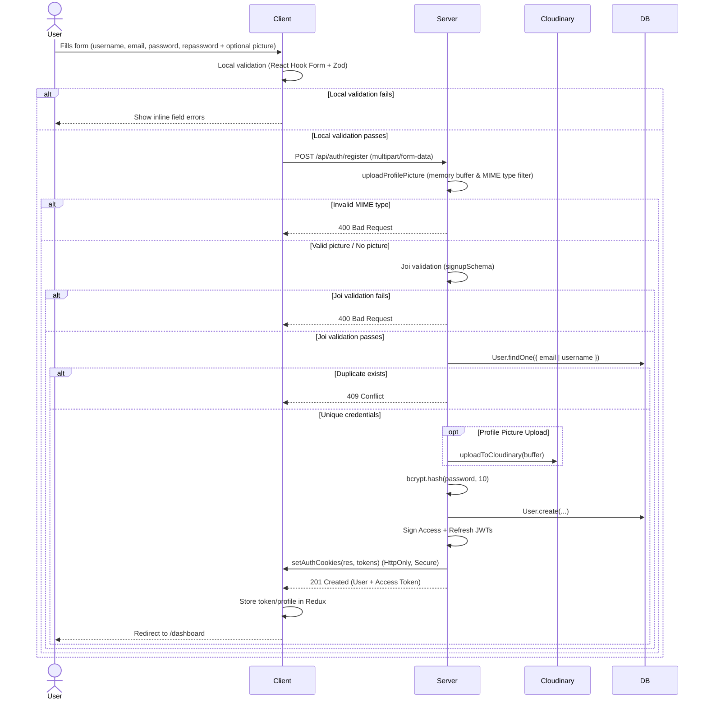
```mermaid
sequenceDiagram
    actor User
    participant Client
    participant Server
    participant Cloudinary
    participant DB

    User->>Client: Fills form (username, email, password, repassword + optional picture)
    Client->>Client: Local validation (React Hook Form + Zod)
    alt Local validation fails
        Client-->>User: Show inline field errors
    else Local validation passes
        Client->>Server: POST /api/auth/register (multipart/form-data)
        Server->>Server: uploadProfilePicture (memory buffer & MIME type filter)
        alt Invalid MIME type
            Server-->>Client: 400 Bad Request
        else Valid picture / No picture
            Server->>Server: Joi validation (signupSchema)
            alt Joi validation fails
                Server-->>Client: 400 Bad Request
            else Joi validation passes
                Server->>DB: User.findOne({ email | username })
                alt Duplicate exists
                    Server-->>Client: 409 Conflict
                else Unique credentials
                    opt Profile Picture Upload
                        Server->>Cloudinary: uploadToCloudinary(buffer)
                    end
                    Server->>Server: bcrypt.hash(password, 10)
                    Server->>DB: User.create(...)
                    Server->>Server: Sign Access + Refresh JWTs
                    Server->>Client: setAuthCookies(res, tokens) (HttpOnly, Secure)
                    Server-->>Client: 201 Created (User + Access Token)
                    Client->>Client: Store token/profile in Redux
                    Client-->>User: Redirect to /dashboard
                end
            end
        end
    end
```

#### Error paths

| Error | HTTP | User sees |
|-------|------|-----------|
| Duplicate email/username | 409 | "Email or username already in use." |
| Joi validation failure | 400 | Field-level errors on the form |
| Image MIME type wrong | 400 | "Invalid file type" |
| Cloudinary failure | 500 | Generic error toast |
| DB failure | 500 | Generic error toast |

---

### 1.2 Login

**Entry point:** `/login` page → `LoginForm` component

#### Step-by-step

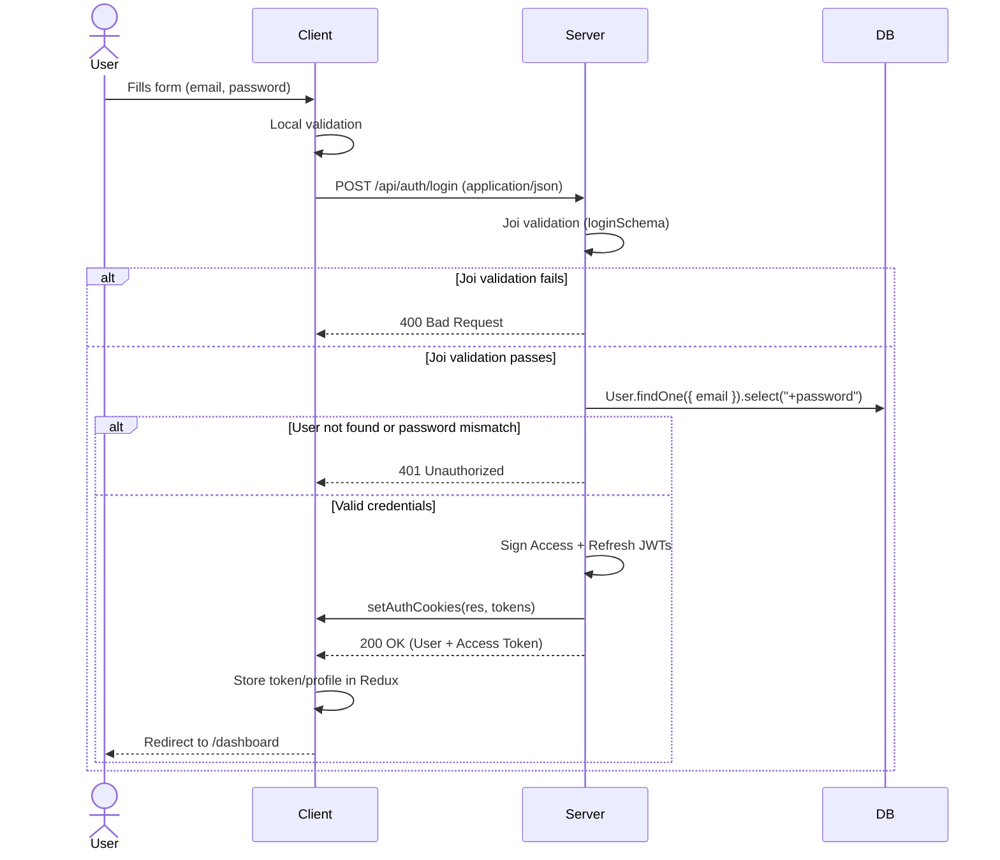
```mermaid
sequenceDiagram
    actor User
    participant Client
    participant Server
    participant DB

    User->>Client: Fills form (email, password)
    Client->>Client: Local validation
    Client->>Server: POST /api/auth/login (application/json)
    Server->>Server: Joi validation (loginSchema)
    alt Joi validation fails
        Server-->>Client: 400 Bad Request
    else Joi validation passes
        Server->>DB: User.findOne({ email }).select("+password")
        alt User not found or password mismatch
            Server-->>Client: 401 Unauthorized
        else Valid credentials
            Server->>Server: Sign Access + Refresh JWTs
            Server->>Client: setAuthCookies(res, tokens)
            Server-->>Client: 200 OK (User + Access Token)
            Client->>Client: Store token/profile in Redux
            Client-->>User: Redirect to /dashboard
        end
    end
```

#### Error paths

| Error | HTTP | User sees |
|-------|------|-----------|
| Wrong credentials | 401 | "Invalid email or password." |
| Validation failure | 400 | Field errors |

---

### 1.3 Logout

**Entry point:** User menu → Logout button

#### Step-by-step

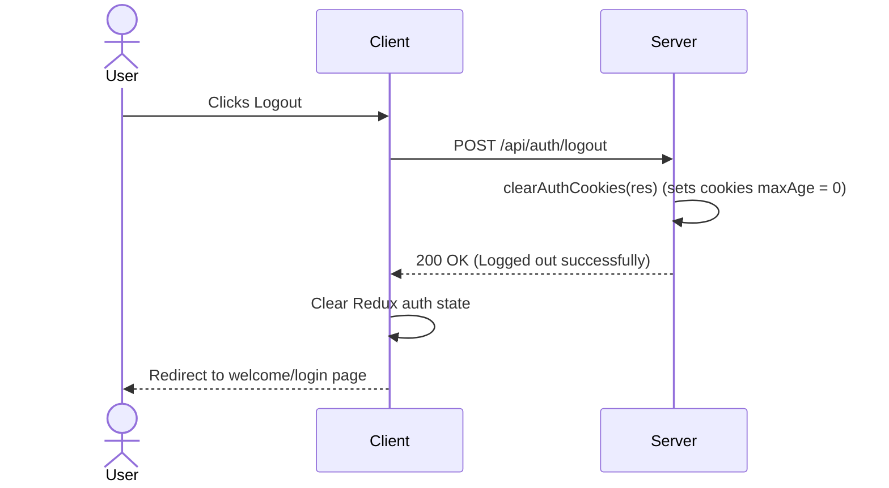
```mermaid
sequenceDiagram
    actor User
    participant Client
    participant Server

    User->>Client: Clicks Logout
    Client->>Server: POST /api/auth/logout
    Server->>Server: clearAuthCookies(res) (sets cookies maxAge = 0)
    Server-->>Client: 200 OK (Logged out successfully)
    Client->>Client: Clear Redux auth state
    Client-->>User: Redirect to welcome/login page
```

---

### 1.4 Refresh Token (silent)

**Entry point:** Automatic — triggered by `AuthBootstrap` on app mount, or when an API request gets 401.

#### Step-by-step

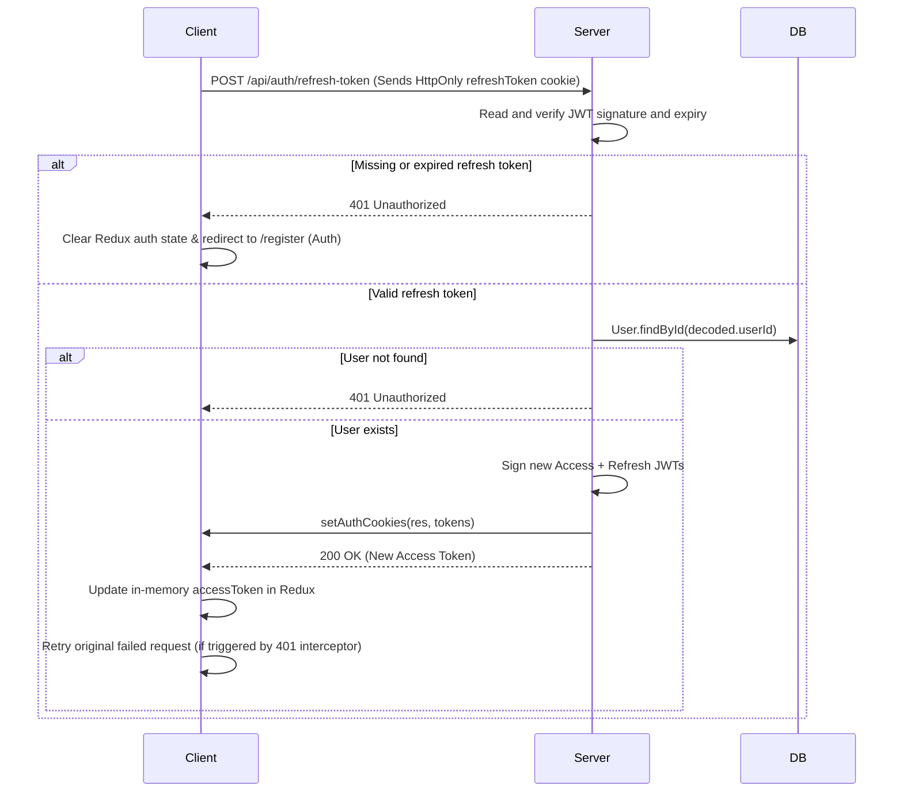
```mermaid
sequenceDiagram
    participant Client
    participant Server
    participant DB

    Client->>Server: POST /api/auth/refresh-token (Sends HttpOnly refreshToken cookie)
    Server->>Server: Read and verify JWT signature and expiry
    alt Missing or expired refresh token
        Server-->>Client: 401 Unauthorized
        Client->>Client: Clear Redux auth state & redirect to /register (Auth)
    else Valid refresh token
        Server->>DB: User.findById(decoded.userId)
        alt User not found
            Server-->>Client: 401 Unauthorized
        else User exists
            Server->>Server: Sign new Access + Refresh JWTs
            Server->>Client: setAuthCookies(res, tokens)
            Server-->>Client: 200 OK (New Access Token)
            Client->>Client: Update in-memory accessToken in Redux
            Client->>Client: Retry original failed request (if triggered by 401 interceptor)
        end
    end
```

#### Error paths

| Error | HTTP | Result |
|-------|------|--------|
| Missing / expired refresh token | 401 | Client clears auth state → user sees login page |

---

### 1.5 Load Current User (me)

**Entry point:** `AuthBootstrap` on app mount, after successful token refresh.

#### Step-by-step

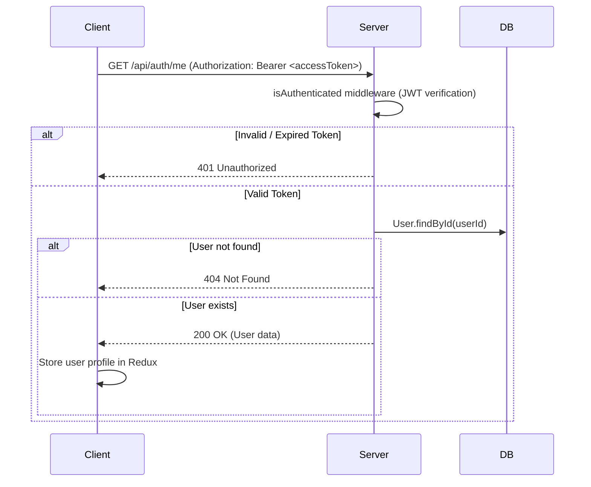
```mermaid
sequenceDiagram
    participant Client
    participant Server
    participant DB

    Client->>Server: GET /api/auth/me (Authorization: Bearer <accessToken>)
    Server->>Server: isAuthenticated middleware (JWT verification)
    alt Invalid / Expired Token
        Server-->>Client: 401 Unauthorized
    else Valid Token
        Server->>DB: User.findById(userId)
        alt User not found
            Server-->>Client: 404 Not Found
        else User exists
            Server-->>Client: 200 OK (User data)
            Client->>Client: Store user profile in Redux
        end
    end
```

---

## 2. Profile Flows

### 2.1 Update Profile Picture

**Entry point:** Settings or profile page → `ProfilePictureUploader`

#### Step-by-step

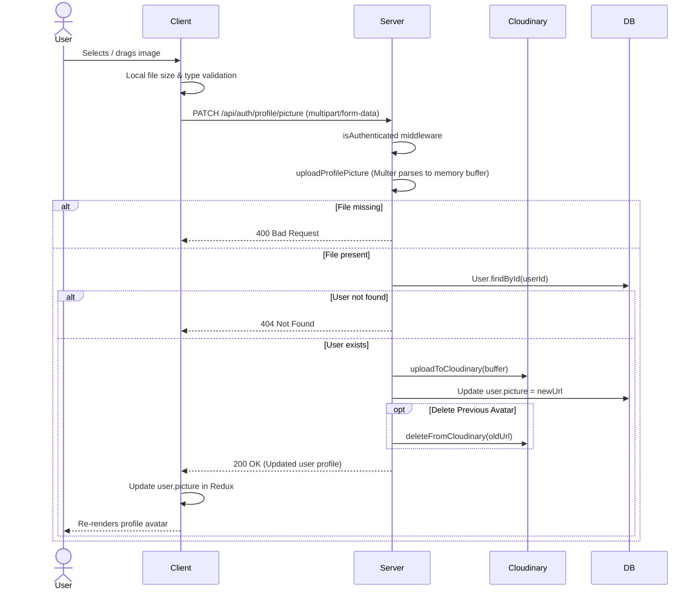
```mermaid
sequenceDiagram
    actor User
    participant Client
    participant Server
    participant Cloudinary
    participant DB

    User->>Client: Selects / drags image
    Client->>Client: Local file size & type validation
    Client->>Server: PATCH /api/auth/profile/picture (multipart/form-data)
    Server->>Server: isAuthenticated middleware
    Server->>Server: uploadProfilePicture (Multer parses to memory buffer)
    alt File missing
        Server-->>Client: 400 Bad Request
    else File present
        Server->>DB: User.findById(userId)
        alt User not found
            Server-->>Client: 404 Not Found
        else User exists
            Server->>Cloudinary: uploadToCloudinary(buffer)
            Server->>DB: Update user.picture = newUrl
            opt Delete Previous Avatar
                Server->>Cloudinary: deleteFromCloudinary(oldUrl)
            end
            Server-->>Client: 200 OK (Updated user profile)
            Client->>Client: Update user.picture in Redux
            Client-->>User: Re-renders profile avatar
        end
    end
```

#### Error paths

| Error | HTTP | User sees |
|-------|------|-----------|
| No file sent | 400 | "Profile picture is required." |
| Cloudinary error | 500 | Generic toast; old picture unchanged |

---

## 3. App Bootstrap Flow

**Triggered on:** every page load / app mount (`AuthBootstrap.jsx`)

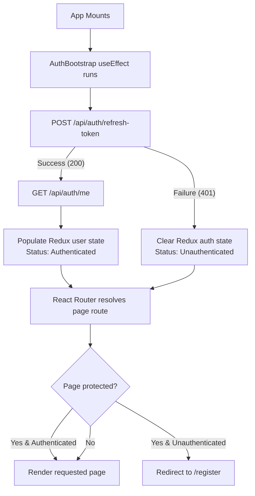
```mermaid
flowchart TD
    Mount["App Mounts"] --> Hook["AuthBootstrap useEffect runs"]
    Hook --> Silent["POST /api/auth/refresh-token"]
    Silent -- "Success (200)" --> GetMe["GET /api/auth/me"]
    GetMe --> ReduxSuccess["Populate Redux user state<br/>Status: Authenticated"]
    Silent -- "Failure (401)" --> ReduxFail["Clear Redux auth state<br/>Status: Unauthenticated"]
    ReduxSuccess & ReduxFail --> Router["React Router resolves page route"]
    Router --> Guard{"Page protected?"}
    Guard -- "Yes & Authenticated" --> RenderPage["Render requested page"]
    Guard -- "Yes & Unauthenticated" --> RedirectLogin["Redirect to /register"]
    Guard -- "No" --> RenderPage
```

---

## 4. Welcome Page Flow

**Entry point:** `/` — public, no auth required

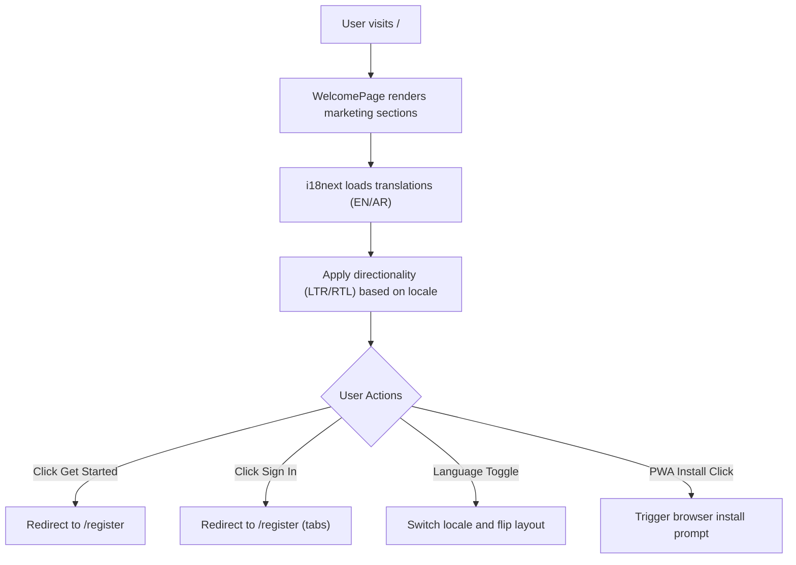
```mermaid
flowchart TD
    Visit["User visits /"] --> Welcome["WelcomePage renders marketing sections"]
    Welcome --> Translate["i18next loads translations (EN/AR)"]
    Translate --> Layout["Apply directionality (LTR/RTL) based on locale"]
    Layout --> Actions{"User Actions"}
    Actions -- "Click Get Started" --> Register["Redirect to /register"]
    Actions -- "Click Sign In" --> Login["Redirect to /register (tabs)"]
    Actions -- "Language Toggle" --> Toggle["Switch locale and flip layout"]
    Actions -- "PWA Install Click" --> PWA["Trigger browser install prompt"]
```

---

## 5. About Page Flow

**Entry point:** `/about` — public

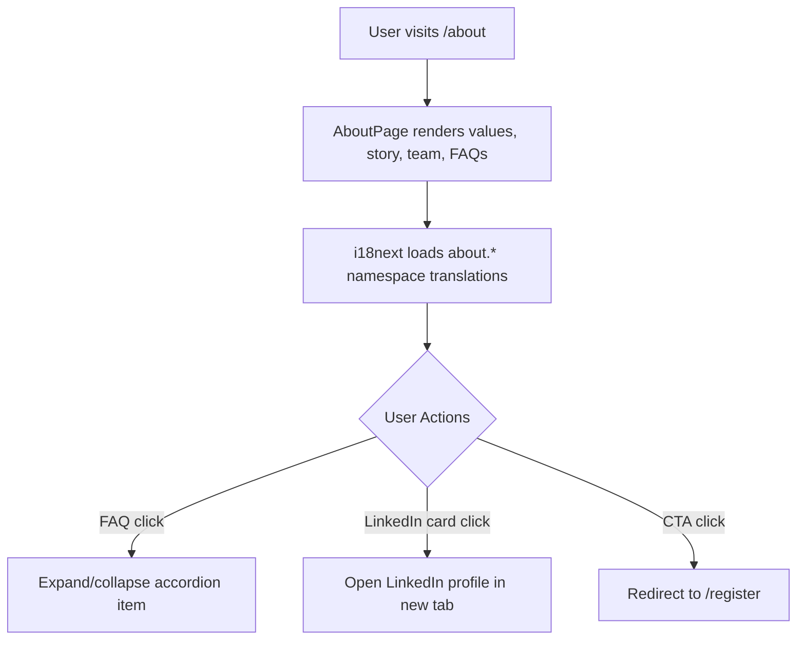
```mermaid
flowchart TD
    Visit["User visits /about"] --> About["AboutPage renders values, story, team, FAQs"]
    About --> Translate["i18next loads about.* namespace translations"]
    Translate --> Actions{"User Actions"}
    Actions -- "FAQ click" --> FAQ["Expand/collapse accordion item"]
    Actions -- "LinkedIn card click" --> LinkedIn["Open LinkedIn profile in new tab"]
    Actions -- "CTA click" --> CTA["Redirect to /register"]
```

---

## 6. Meter & Bill Flow

**Entry point:** `/meters` (user dashboard) or `/bills`

Consumption data enters the system through manual bill entry linked to meters. There is no automated OCR or hardware pipeline.

### 6.1 Create a Meter

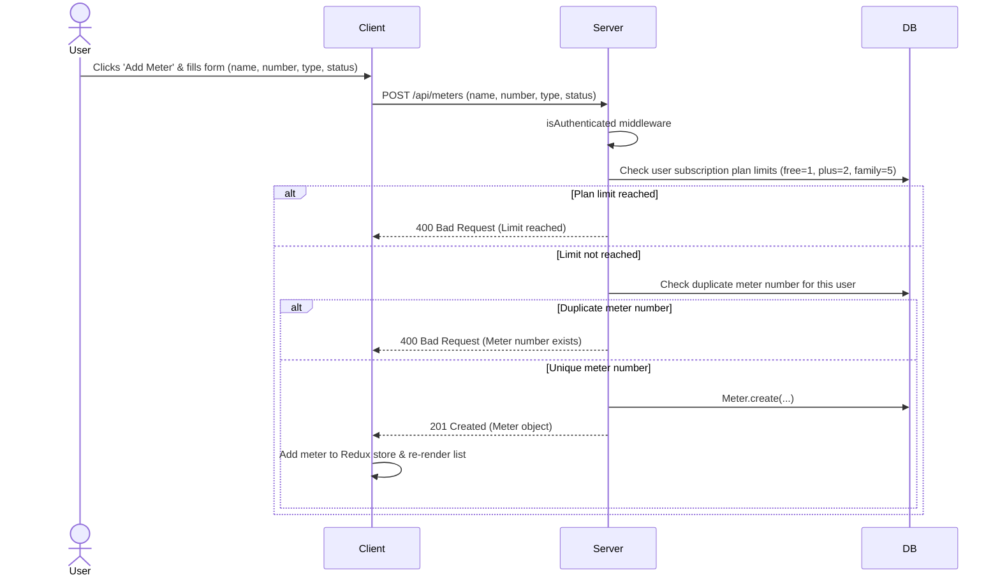
```mermaid
sequenceDiagram
    actor User
    participant Client
    participant Server
    participant DB

    User->>Client: Clicks 'Add Meter' & fills form (name, number, type, status)
    Client->>Server: POST /api/meters (name, number, type, status)
    Server->>Server: isAuthenticated middleware
    Server->>DB: Check user subscription plan limits (free=1, plus=2, family=5)
    alt Plan limit reached
        Server-->>Client: 400 Bad Request (Limit reached)
    else Limit not reached
        Server->>DB: Check duplicate meter number for this user
        alt Duplicate meter number
            Server-->>Client: 400 Bad Request (Meter number exists)
        else Unique meter number
            Server->>DB: Meter.create(...)
            Server-->>Client: 201 Created (Meter object)
            Client->>Client: Add meter to Redux store & re-render list
        end
    end
```

### 6.2 View Meters (with consumption)

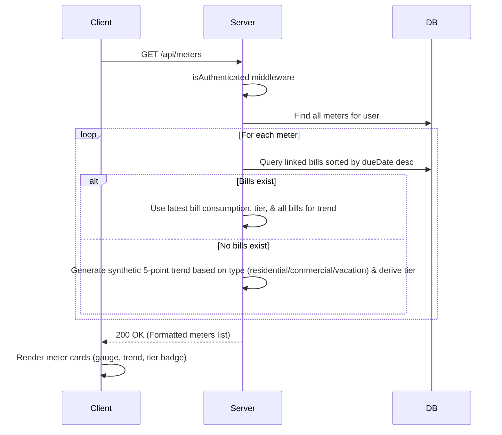
```mermaid
sequenceDiagram
    participant Client
    participant Server
    participant DB

    Client->>Server: GET /api/meters
    Server->>Server: isAuthenticated middleware
    Server->>DB: Find all meters for user
    loop For each meter
        Server->>DB: Query linked bills sorted by dueDate desc
        alt Bills exist
            Server->>Server: Use latest bill consumption, tier, & all bills for trend
        else No bills exist
            Server->>Server: Generate synthetic 5-point trend based on type (residential/commercial/vacation) & derive tier
        end
    end
    Server-->>Client: 200 OK (Formatted meters list)
    Client->>Client: Render meter cards (gauge, trend, tier badge)
```

### 6.3 Add a Bill (Manual Entry)

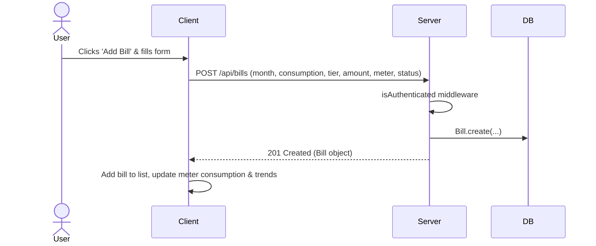
```mermaid
sequenceDiagram
    actor User
    participant Client
    participant Server
    participant DB

    User->>Client: Clicks 'Add Bill' & fills form
    Client->>Server: POST /api/bills (month, consumption, tier, amount, meter, status)
    Server->>Server: isAuthenticated middleware
    Server->>DB: Bill.create(...)
    Server-->>Client: 201 Created (Bill object)
    Client->>Client: Add bill to list, update meter consumption & trends
```

#### Error paths

| Error | HTTP | User sees |
|-------|------|-----------|
| Missing name/number for meter | 400 | "Please provide name and number for the meter" |
| Duplicate meter number | 400 | "Meter with this number already exists" |
| Plan meter limit reached | 400 | "You have reached the maximum number of meters..." |

---

## 7. Dashboard Flow

**Entry point:** `/dashboard`

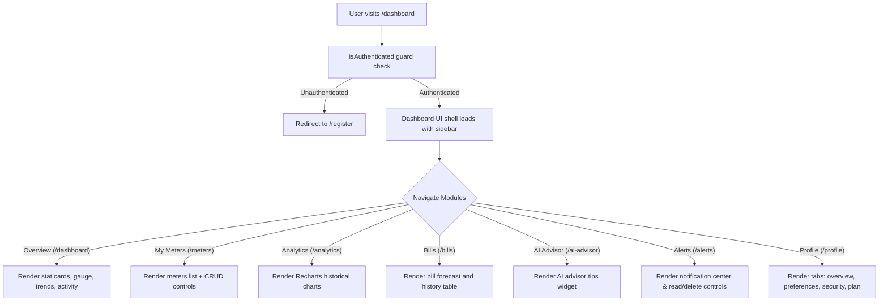
```mermaid
flowchart TD
    Visit["User visits /dashboard"] --> Guard["isAuthenticated guard check"]
    Guard -- "Unauthenticated" --> Redirect["Redirect to /register"]
    Guard -- "Authenticated" --> Load["Dashboard UI shell loads with sidebar"]
    Load --> Nav{"Navigate Modules"}
    Nav -- "Overview (/dashboard)" --> Overview["Render stat cards, gauge, trends, activity"]
    Nav -- "My Meters (/meters)" --> Meters["Render meters list + CRUD controls"]
    Nav -- "Analytics (/analytics)" --> Analytics["Render Recharts historical charts"]
    Nav -- "Bills (/bills)" --> Bills["Render bill forecast and history table"]
    Nav -- "AI Advisor (/ai-advisor)" --> Advisor["Render AI advisor tips widget"]
    Nav -- "Alerts (/alerts)" --> Alerts["Render notification center & read/delete controls"]
    Nav -- "Profile (/profile)" --> Profile["Render tabs: overview, preferences, security, plan"]
```

---

## 8. Simulation Sandbox Flow

**Entry point:** `/simulations` — virtual appliance sandbox for what-if analysis and AI advice

### 8.1 Create & Configure Simulation

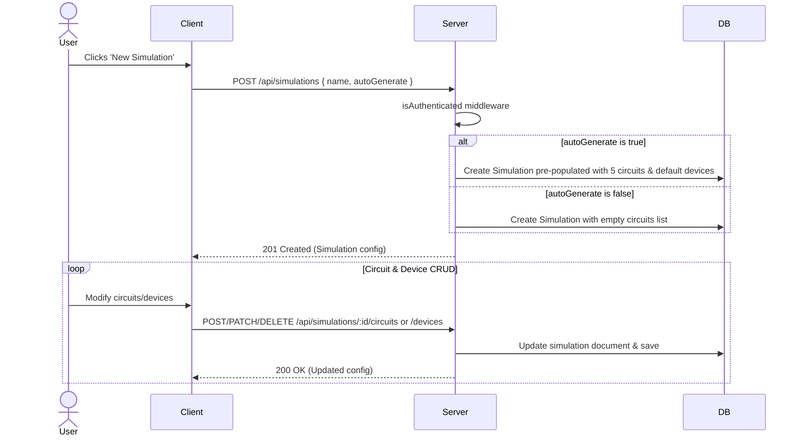
```mermaid
sequenceDiagram
    actor User
    participant Client
    participant Server
    participant DB

    User->>Client: Clicks 'New Simulation'
    Client->>Server: POST /api/simulations { name, autoGenerate }
    Server->>Server: isAuthenticated middleware
    alt autoGenerate is true
        Server->>DB: Create Simulation pre-populated with 5 circuits & default devices
    else autoGenerate is false
        Server->>DB: Create Simulation with empty circuits list
    end
    Server-->>Client: 201 Created (Simulation config)
    loop Circuit & Device CRUD
        User->>Client: Modify circuits/devices
        Client->>Server: POST/PATCH/DELETE /api/simulations/:id/circuits or /devices
        Server->>DB: Update simulation document & save
        Server-->>Client: 200 OK (Updated config)
    end
```

### 8.2 Run Simulation

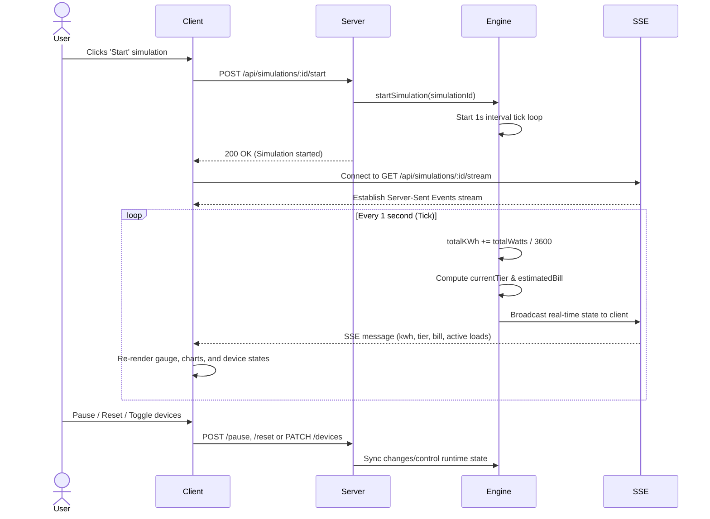
```mermaid
sequenceDiagram
    actor User
    participant Client
    participant Server
    participant Engine
    participant SSE

    User->>Client: Clicks 'Start' simulation
    Client->>Server: POST /api/simulations/:id/start
    Server->>Engine: startSimulation(simulationId)
    Engine->>Engine: Start 1s interval tick loop
    Server-->>Client: 200 OK (Simulation started)
    Client->>SSE: Connect to GET /api/simulations/:id/stream
    SSE-->>Client: Establish Server-Sent Events stream
    loop Every 1 second (Tick)
        Engine->>Engine: totalKWh += totalWatts / 3600
        Engine->>Engine: Compute currentTier & estimatedBill
        Engine->>SSE: Broadcast real-time state to client
        SSE-->>Client: SSE message (kwh, tier, bill, active loads)
        Client->>Client: Re-render gauge, charts, and device states
    end
    User->>Client: Pause / Reset / Toggle devices
    Client->>Server: POST /pause, /reset or PATCH /devices
    Server->>Engine: Sync changes/control runtime state
```

### 8.3 Tier Prediction

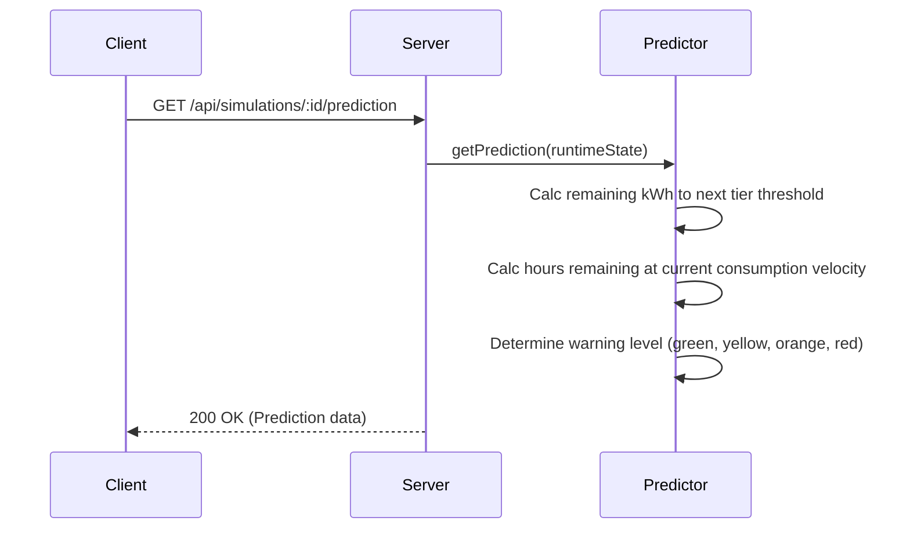
```mermaid
sequenceDiagram
    participant Client
    participant Server
    participant Predictor

    Client->>Server: GET /api/simulations/:id/prediction
    Server->>Predictor: getPrediction(runtimeState)
    Predictor->>Predictor: Calc remaining kWh to next tier threshold
    Predictor->>Predictor: Calc hours remaining at current consumption velocity
    Predictor->>Predictor: Determine warning level (green, yellow, orange, red)
    Server-->>Client: 200 OK (Prediction data)
```

### 8.4 What-If Analysis

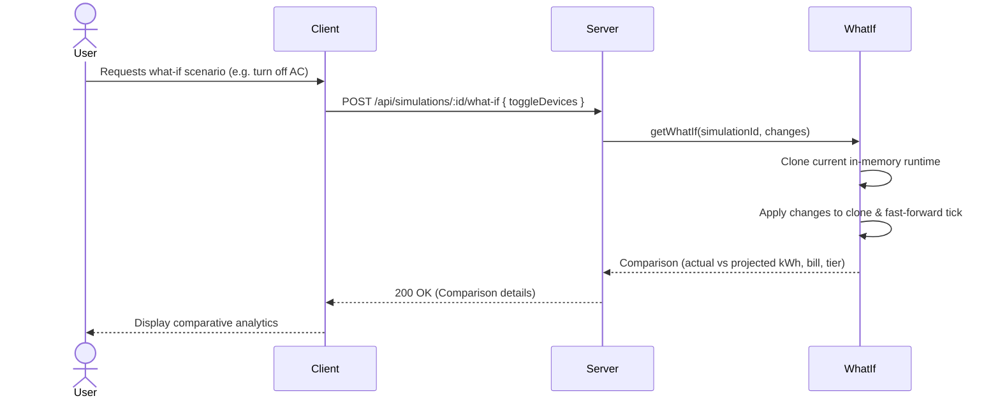
```mermaid
sequenceDiagram
    actor User
    participant Client
    participant Server
    participant WhatIf

    User->>Client: Requests what-if scenario (e.g. turn off AC)
    Client->>Server: POST /api/simulations/:id/what-if { toggleDevices }
    Server->>WhatIf: getWhatIf(simulationId, changes)
    WhatIf->>WhatIf: Clone current in-memory runtime
    WhatIf->>WhatIf: Apply changes to clone & fast-forward tick
    WhatIf-->>Server: Comparison (actual vs projected kWh, bill, tier)
    Server-->>Client: 200 OK (Comparison details)
    Client-->>User: Display comparative analytics
```

---

## 9. AI Features Flow

AI features are powered by **Groq** (Llama 3.3 70B) via an OpenAI-compatible client, focused on the simulation sandbox.

### 9.1 AI Consumption Advisor

**Entry point:** Simulation detail page → "Get Advice" button

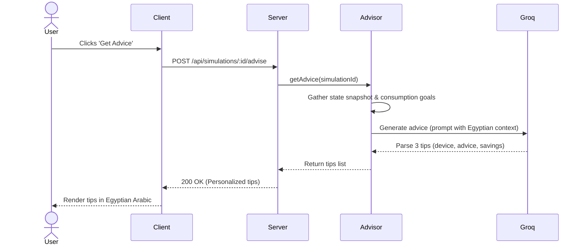
```mermaid
sequenceDiagram
    actor User
    participant Client
    participant Server
    participant Advisor
    participant Groq

    User->>Client: Clicks 'Get Advice'
    Client->>Server: POST /api/simulations/:id/advise
    Server->>Advisor: getAdvice(simulationId)
    Advisor->>Advisor: Gather state snapshot & consumption goals
    Advisor->>Groq: Generate advice (prompt with Egyptian context)
    Groq-->>Advisor: Parse 3 tips (device, advice, savings)
    Advisor-->>Server: Return tips list
    Server-->>Client: 200 OK (Personalized tips)
    Client-->>User: Render tips in Egyptian Arabic
```

### 9.2 Smart Recommendations

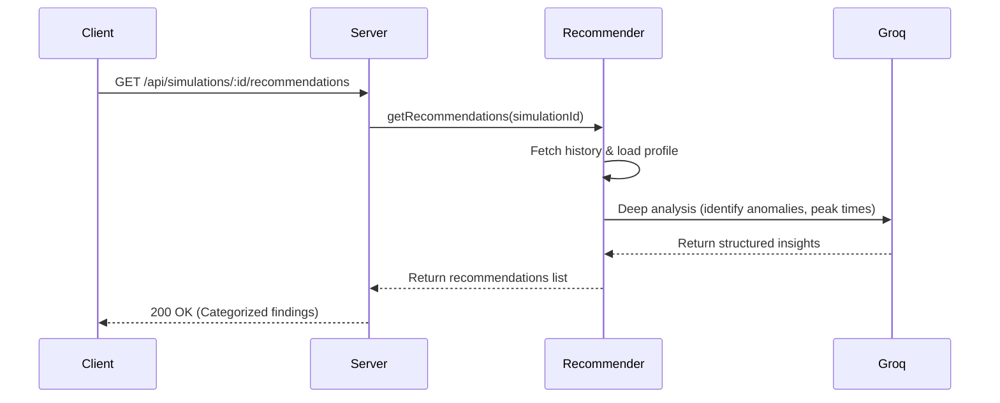
```mermaid
sequenceDiagram
    participant Client
    participant Server
    participant Recommender
    participant Groq

    Client->>Server: GET /api/simulations/:id/recommendations
    Server->>Recommender: getRecommendations(simulationId)
    Recommender->>Recommender: Fetch history & load profile
    Recommender->>Groq: Deep analysis (identify anomalies, peak times)
    Groq-->>Recommender: Return structured insights
    Recommender-->>Server: Return recommendations list
    Server-->>Client: 200 OK (Categorized findings)
```

### 9.3 Natural Language Chat

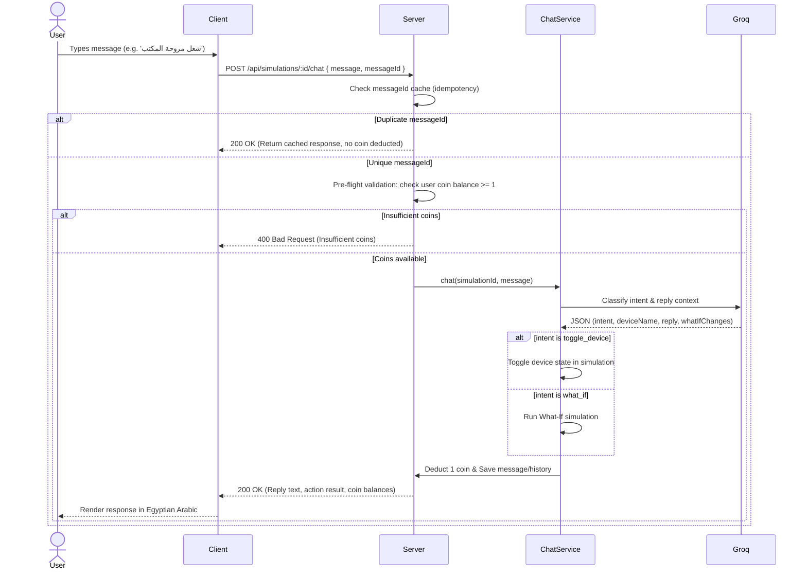
```mermaid
sequenceDiagram
    actor User
    participant Client
    participant Server
    participant ChatService
    participant Groq

    User->>Client: Types message (e.g. 'شغل مروحة المكتب')
    Client->>Server: POST /api/simulations/:id/chat { message, messageId }
    Server->>Server: Check messageId cache (idempotency)
    alt Duplicate messageId
        Server-->>Client: 200 OK (Return cached response, no coin deducted)
    else Unique messageId
        Server->>Server: Pre-flight validation: check user coin balance >= 1
        alt Insufficient coins
            Server-->>Client: 400 Bad Request (Insufficient coins)
        else Coins available
            Server->>ChatService: chat(simulationId, message)
            ChatService->>Groq: Classify intent & reply context
            Groq-->>ChatService: JSON (intent, deviceName, reply, whatIfChanges)
            alt intent is toggle_device
                ChatService->>ChatService: Toggle device state in simulation
            else intent is what_if
                ChatService->>ChatService: Run What-If simulation
            end
            ChatService->>Server: Deduct 1 coin & Save message/history
            Server-->>Client: 200 OK (Reply text, action result, coin balances)
            Client-->>User: Render response in Egyptian Arabic
        end
    end
```

#### Error paths

| Error | HTTP | User sees |
|-------|------|-----------|
| Insufficient coins | 400 | "Insufficient coins. Please upgrade..." |
| Idempotent duplicate (same message within 5s) | 200 | Cached response, no coin deducted |

### 9.4 Auto-Pilot

```mermaid
sequenceDiagram
    actor User
    participant Client
    participant Server
    participant DB
    participant Engine

    User->>Client: Enables Auto-Pilot & sets monthly limit goal
    Client->>Server: POST /api/simulations/:id/auto-pilot/start { monthlyKwhLimit }
    Server->>DB: Save goal and enable autoPilot flag
    Server->>Engine: startAutoPilot(simulationId)
    Server-->>Client: 200 OK (Auto-pilot enabled)
    loop Every Tick inside Engine
        Engine->>Engine: Check projected monthly usage
        alt projectedUsage > monthlyKwhLimit
            Engine->>Engine: Rank non-essential devices by wattage
            Engine->>DB: Turn OFF highest-wattage non-essential device & save
            Engine->>DB: Log activity (auto-pilot intervention)
            Engine->>Engine: Broadcast update via SSE
        end
    end
```

---

## 10. History Flow

**Entry point:** `/bills`

```mermaid
sequenceDiagram
    participant Client
    participant Server
    participant DB

    Client->>Server: GET /api/bills?page=1&limit=10&status=all
    Server->>DB: Query bills filtered by status/year, sorted by dueDate desc
    DB-->>Server: Return paginated bills list with populated meter details
    Server-->>Client: 200 OK (Bills + pagination data)
    Client->>Client: Render bill list & history table
```

---

## 11. Admin Flows *(planned)*

### Admin Login

Same as user login, but `user.role === "admin"` → redirected to `/admin/dashboard`.

### Admin route guard

```mermaid
flowchart TD
    Req["Request to /api/admin/* or /admin/* page"] --> Auth["isAuthenticated Middleware"]
    Auth -- "Invalid Token" --> Err401["401 Unauthorized"]
    Auth -- "Valid Token" --> AdminCheck["isAdmin Middleware"]
    AdminCheck -- "role !== 'admin'" --> Err403["403 Forbidden"]
    AdminCheck -- "role === 'admin'" --> Route["Forward to Admin Route / Render Admin Page"]
```

### Planned admin operations

| Operation | Endpoint | Notes |
|-----------|----------|-------|
| List users | `GET /api/admin/users` | Paginated |
| Disable user | `PATCH /api/admin/users/:id/disable` | Sets user.active = false |
| List all bills | `GET /api/admin/bills` | |
| Manage tiers | `GET/POST/PATCH/DELETE /api/admin/tiers` | Sheriha pricing rules |
| View AI logs | `GET /api/admin/ai-logs` | Groq prompt/response audit trail |

---

## Appendix: Cookie Strategy

| Cookie | Name | Lifetime | Flags |
|--------|------|----------|-------|
| Access token | `accessToken` | `JWT_ACCESS_EXPIRES_IN` (default 15m) | `HttpOnly`, `Secure`, `SameSite=None` |
| Refresh token | `refreshToken` | `JWT_REFRESH_EXPIRES_IN` (default 7d) | `HttpOnly`, `Secure`, `SameSite=None` |

- `HttpOnly` — not accessible by JavaScript (XSS protection)
- `Secure` — only sent over HTTPS
- `SameSite=None` — required for cross-origin requests (client and server on different Vercel projects)
- `Credentials: true` must be set on both the client `fetch`/`axios` config and the server CORS config

---

## Appendix: Auth State Machine (client)

```mermaid
stateDiagram-v2
    [*] --> INITIAL
    INITIAL --> LOADING : App Mount
    LOADING --> AUTHENTICATED : refresh success
    LOADING --> UNAUTHENTICATED : refresh fail (401)
    AUTHENTICATED --> UNAUTHENTICATED : logout / 401 error
    UNAUTHENTICATED --> AUTHENTICATED : login success
```

---

*Update this document when any new operation is implemented or an existing flow changes.*
